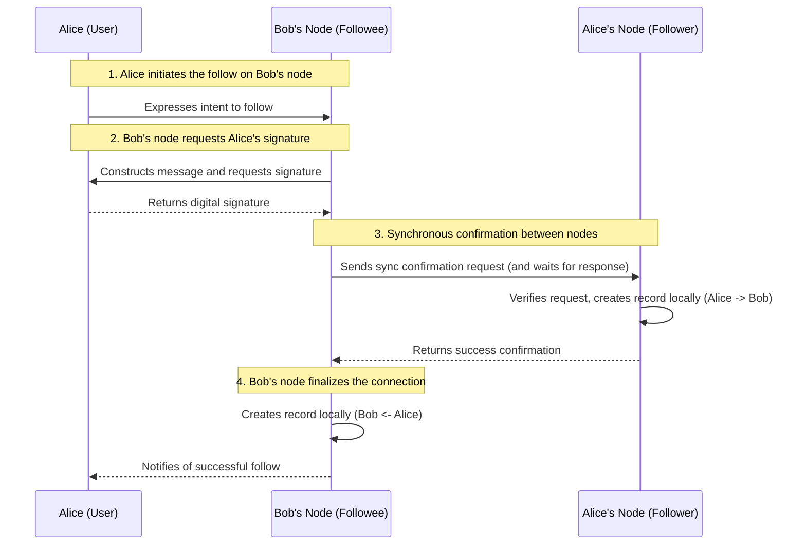
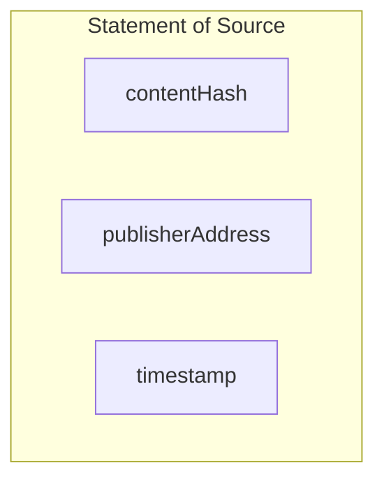
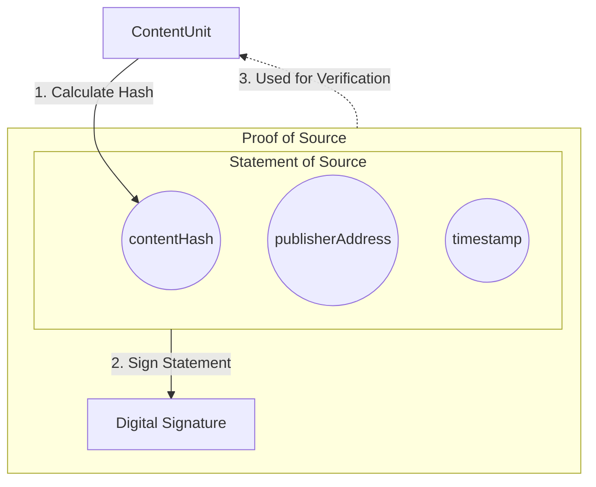
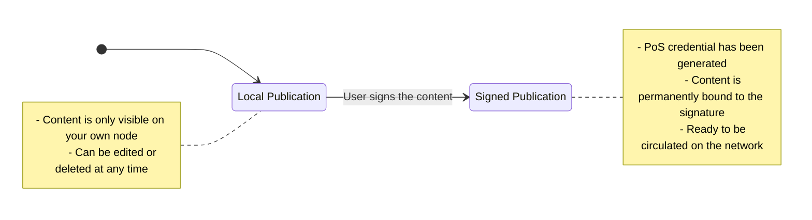
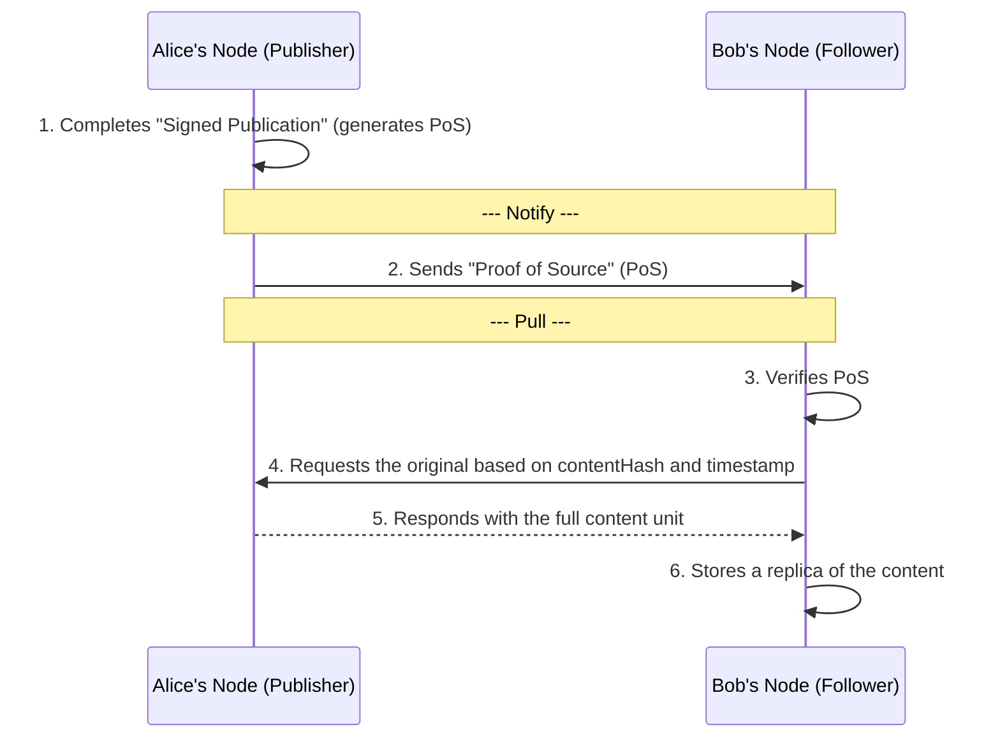
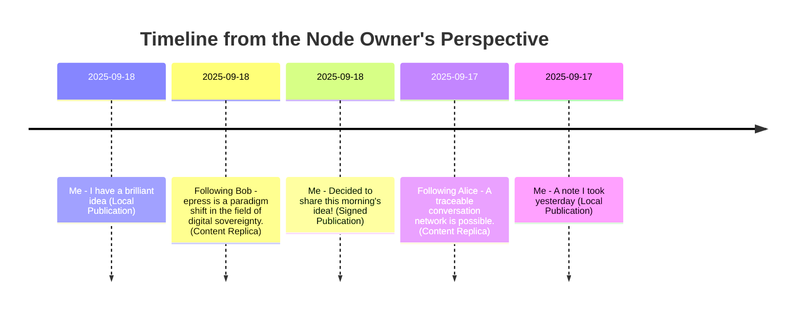
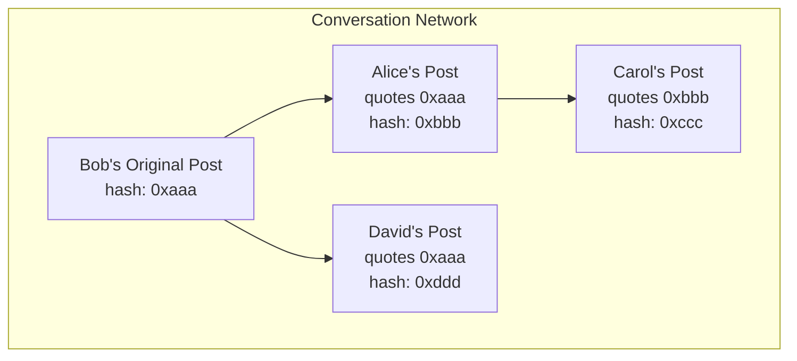
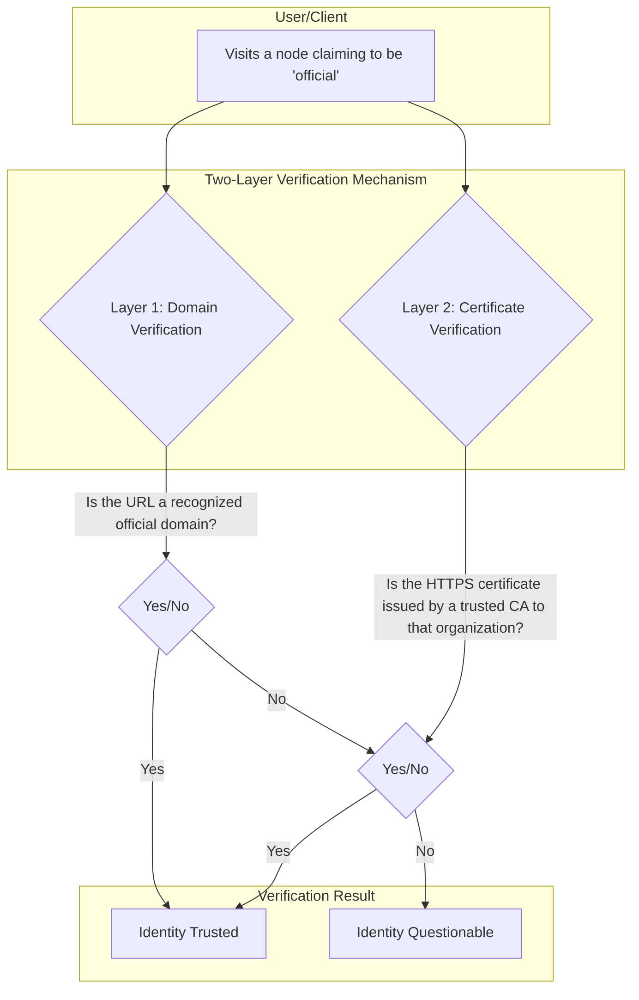
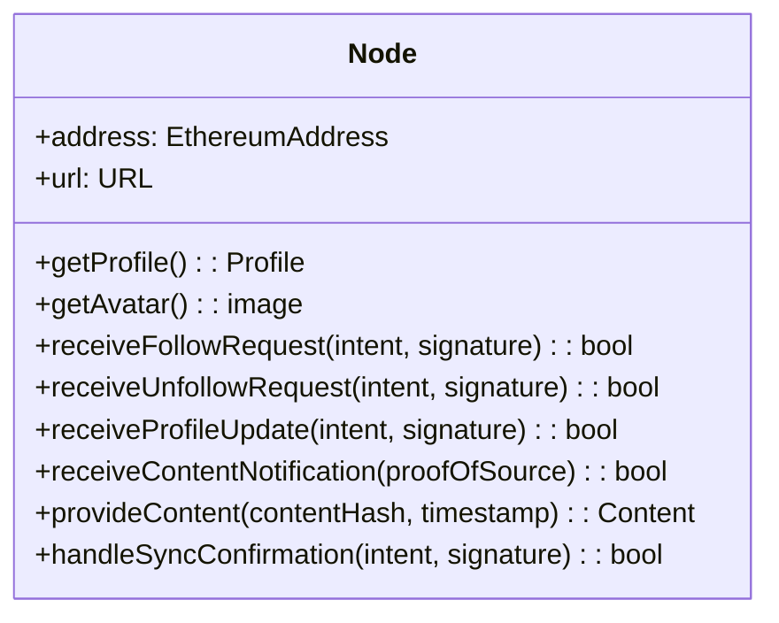

# epress: A Decentralized Content and Social Network

## Abstract

Mainstream centralized networks place users' digital identities, content, and social relationships under the control of third-party platforms, leading to a systemic loss of sovereignty and inherent platform risks. This paper proposes a decentralized content and social network architecture named epress, designed to fundamentally solve this problem.

epress returns to the first principle of Self-Hosting, defining the network as a collection of countless peer-to-peer nodes. Each node is an independent website cryptographically bound to a user's identity (an Ethereum account), serving as the user's sovereign territory in the digital world. Nodes establish connections and propagate content through an open peer-to-peer protocol (EWP). All publicly published content exists as a verifiable data unit called "Proof of Source," which cryptographically ensures the origin, integrity, and timestamp of any information.

Through this mechanism, epress constructs a network that requires no trust in any centralized institution, where data ownership and control are intrinsically vested in independent individuals. Its ultimate goal is to foster a more open, resilient, and permissionless ecosystem for innovation, evolving the internet from an "Internet of Information" to an "Internet of Value."

## 1\. Introduction

### 1.1 The Trust Dependency of Centralized Networks

The current mainstream internet architecture connects billions of users to a global network managed by centralized servers. This model has greatly facilitated the creation and circulation of information, but its foundation is built on a fragile assumption: users must unconditionally trust a third-party service provider to host their digital identities, content, and social relationships.

Under this architecture, users are more like "digital tenants" of a platform rather than "masters" of their digital homesteads. Their data—whether publicly published articles or private social graphs—is stored on servers that do not belong to them. This separation of ownership leads to a systemic risk: the platform's rule-makers possess the absolute power to unilaterally terminate services. A user's digital life, including a lifetime of creations and reputation, can be stripped away in an instant due to an opaque policy change, an algorithmic misjudgment, or merely a shift in the business model.

We believe that a system requiring users to cede sovereignty over their data is fundamentally unreliable.

### 1.2 Limitations of Existing Solutions

To address the challenges posed by centralization, the community has undertaken numerous valuable explorations. However, existing mainstream decentralized models have made compromises to varying degrees and have failed to solve the problem at its root. The core issue lies in their **inability to completely eliminate dependency on third-party infrastructure**.

#### 1.2.1 Limitations of the Federated Model

Federated networks, represented by Mastodon and Bluesky, decentralize trust from a single "large center" to thousands of "small centers" (instances) operated by independent administrators. This is undoubtedly a huge step forward, but its essence is a "transfer of trust" rather than an "elimination of trust." Users' data and identities are still hosted on the servers of their respective instances, subject to the governance of that instance's administrator.

A deeper problem is that the operators of these "small centers" need to continuously invest in servers, storage, and bandwidth. From an economic perspective, they will inevitably need to commercialize, whether through advertising or other monetization methods. This subjects federated networks to similar commercial pressures as centralized platforms in their later stages of development, leaving users' digital sovereignty unrealized.

#### 1.2.2 Limitations of the Relay Model

The relay model, represented by Nostr, uses a minimalist protocol and a set of "relays" to transmit messages. The simplicity of this design is commendable, but it hinges the network's vitality and content availability on the stable operation of these relays, which function like "bulletin boards."

Whether a user's messages can be seen and retrieved by others depends entirely on these voluntarily-run relays. This not only introduces new uncertainties to the stability of information flow but also fails to solve the dependency on third-party infrastructure. The health of the network relies on the "goodwill" of a group of anonymous operators whose motivations and capabilities cannot be guaranteed.

#### 1.2.3 Limitations of On-Chain/Hybrid Models

Some decentralized social protocols advocate for anchoring more critical state on-chain to achieve immutability and strong identity guarantees. However, as mature implementations like Farcaster have shown, real-world systems typically adopt a **hybrid architecture**: a small amount of information, such as accounts, identities, and key metadata, is anchored on-chain (e.g., in contracts on Optimism/Ethereum), while the majority of high-frequency, large-volume social interactions (posts, follows, likes, post bodies, etc.) are handled in an off-chain P2P server network called Hubs / Snapchain (Farcaster's off-chain P2P network) to achieve usability and throughput scalability.

This trade-off introduces two parallel sets of limitations. On one hand, any operation that requires on-chain interaction is still constrained by the blockchain's throughput and fee volatility: during network congestion, the cost and latency of on-chain transactions increase significantly, affecting user experience and the predictability of scaling. On the other hand, although the off-chain Hub network is decentralized and allows anyone to run a node, it still relies on node operators to invest in bandwidth, storage, and maintenance resources. This introduces real economic costs, availability risks, and potential centralization pressures (e.g., a few high-performance nodes handling the majority of requests). Therefore, Farcaster does not offer a silver bullet that "solves on-chain limitations while completely eliminating third-party dependency"; it merely strikes a different balance in the trade-offs between on-chain and off-chain.

**In summary, while existing models each have their merits, none has escaped the fundamental dependency on third-party infrastructure.** As long as service availability must be exchanged for ceded control, the inherent risks of centralized networks cannot be eradicated. This compels us to re-examine the root of the problem and seek a more resilient path.

### 1.3 Self-Hosting: A Return to the Internet's Origins

The Web 2.0 model we know today, where a few tech giants provide "one-stop" services, has traded user control for ultimate convenience, transforming users from masters of the network into tenants on these platforms. We believe that to fundamentally return digital sovereignty to the individual, the most effective path is not to create a new paradigm, but to **return** to a more resilient path that has been proven by history: **Self-Hosting**.

This choice is not an attempt to be unconventional; it stems from a desire to trace back to the origins of the internet's architecture and the spirit behind it. The birth of the internet was accompanied by a strong utopian spirit, reflected in:

  * **Freedom of Information and Sharing**: The original purpose of the World Wide Web was to allow knowledge to flow freely without barriers.
  * **Decentralization and Equality**: The network was envisioned as a space without a central authority, where everyone could participate equally, like the early Usenet and BBS.
  * **Techno-Optimism**: People believed that technology was a liberating force for promoting democracy and global connection.
  * **Community and Collaboration**: An emphasis on collective creation and community spirit, with Wikipedia being the pinnacle of this collaborative vision.

This spirit directly gave rise to the internet's early technical architecture: a peer-to-peer network composed of countless independent nodes interconnected by open protocols (like HTTP, SMTP). This architecture, from its inception, embodied a profound decentralized ideology, allowing any organization or individual to run their own server and connect to the global network as an equal.

However, the widespread adoption of this individual-centric ideal faced two insurmountable obstacles at the time:

1.  **High Costs**: Individual users could not afford the expense of dedicated servers and bandwidth.
2.  **Technical Complexity**: Deploying and maintaining a web server was beyond the reach of the average person.

It was these two obstacles that allowed convenient, centralized services to eventually dominate the internet, gradually making us forget the more open, individual-centric possibilities. But today, these barriers are being dismantled by technological progress:

1.  **On Cost**: The proliferation of cloud computing has significantly lowered the baseline cost of servers. At the same time, by carefully designing applications to be compatible with low-cost environments such as personal computers or home servers, it is entirely possible to provide users with a near-zero-cost operating solution.
2.  **On Technology**: The elimination of technical barriers is proceeding along two paths. The first path is through clever software engineering and AI-assisted automated operations, encapsulating complex deployment and maintenance processes into products that ordinary users can easily use. The second path is an evolution of social division of labor, which aligns more closely with reality: just as we use home appliances without needing to understand their internal workings and can call a professional technician when they break, the future self-hosting ecosystem will inevitably give rise to professional "digital plumbers" who provide paid maintenance services for individual nodes. Users will not need to be technical experts to enjoy the full benefits of self-hosting.

Therefore, the feasibility of self-hosting today is no longer a question of "if" but "how"—a matter of achieving mass adoption through clever software design and healthy ecosystem development. Consequently, building a global-scale decentralized social network by popularizing self-hosting is theoretically feasible, and its realization depends on whether we can solve the challenges involved.

### 1.4 Core Challenges

Building a fully functional, seamless global social network based on the principle of self-hosting is not easy. It requires us to address four interconnected core technical challenges from first principles:

1.  **Decentralized Identity**: In a world without a centralized registration authority, how can users own and prove their identity?
2.  **Decentralized Connection**: Without central servers, how do users discover each other and establish stable social connections?
3.  **Decentralized Content Circulation**: How can we design a mechanism for content created by one user to be efficiently and reliably delivered to all of their followers?
4.  **Timeline Generation**: How does each user aggregate their own published content and the content from everyone they follow into a single, coherent local timeline?

## 2\. Identity: Ethereum Accounts

In any social network, a stable and unique identity is the foundation for all interactions. In a system without a centralized registration authority, we must find an identity solution that is permissionless and fully controlled by the user. To this end, epress chooses to directly adopt the most mature and widespread decentralized identity system available today: **Ethereum accounts**.

### 2.1 Decentralized Identity

In the epress network, a user's identity is their Ethereum address. We choose Ethereum accounts as the identity layer based on their inherent, irreplaceable advantages:

  * **Sovereign Ownership**: Every Ethereum account is controlled by a unique private key. Only the holder of the private key can act on behalf of that account. This fundamentally guarantees that ownership of the identity belongs solely to the user.
  * **Permissionless**: Anyone can freely create any number of Ethereum accounts without the approval or permission of any central authority. This ensures that acquiring an identity is fair and accessible to all.
  * **Globally Unique**: An Ethereum address is a globally unique identifier, ensuring that there is no identity confusion within the network.
  * **Secure and Reliable**: The Ethereum ecosystem has undergone years of development and real-world testing, and the security of its public-private key cryptography is widely recognized. Adopting it means we do not need to reinvent a fragile identity system.

Therefore, an Ethereum address, in the form of `0x...`, becomes the user's sole, portable "digital passport" in the world of epress.

### 2.2 Identity Authentication

Once identity is established, a mechanism is needed for users to securely prove their ownership of that identity. epress uses digital signature technology from cryptography, combined with two standards widely adopted by the Ethereum community, to achieve this.

  - **Authentication between the node owner and their node**: When a user needs to manage their node (e.g., publishing new content, changing settings), the system will present a human-readable text message according to the [EIP-4361](https://eips.ethereum.org/EIPS/eip-4361): Sign-In with Ethereum (SIWE) standard. The user signs the message with their Ethereum wallet (such as MetaMask), and the node can then verify the signature to confirm that the user is indeed the holder of that address. This process replaces the traditional username-password combination, ensuring that only the key holder can manage the node.

  - **Authentication between the node owner and other nodes**: When a node owner needs to interact with other nodes (e.g., following, commenting), the [EIP-712](https://eips.ethereum.org/EIPS/eip-712) standard for signing structured data is used. To prevent replay attacks, this structured data includes a timestamp, and the receiving node will only consider it valid within a specific time window. This allows the receiving node to verify the validity of the signer's signature, ensuring the action was genuinely authorized by the owner of the declared Ethereum address and preventing identity forgery and impersonation.

## 3\. Node: The Basic Unit of the Network

The epress network is composed of countless peer-to-peer "Nodes." The node is the most fundamental, independent unit that constitutes the entire network.

Functionally, a node is a fully-featured personal website self-hosted by the user. Users can publish articles, manage pages, and interact with visitors on their own node, much like using WordPress. It is the user's "digital homestead" for content creation, information aggregation, and self-expression on the network.

Architecturally, a node is an independent instance of the epress software that is cryptographically bound to a unique user identity (an Ethereum address). This means that the node and all the data stored within it—including all of the user's works, social relationships, and personal settings—belong entirely to the owner of that identity. Therefore, the node is the user's inviolable "sovereign territory" in the digital world, the ultimate guarantee for the realization of data sovereignty.

To understand how a node operates in practice, we first need to adopt a new worldview: in the epress network, every "node" is not just a personal website, but an independent, active "**social entity**" that represents its owner's complete presence on the network. Therefore, when one node "follows" another, it is not a technical link between websites, but an expression of the node owners' intent to establish a social connection and **subscribe to each other's content updates**, using their nodes as proxies.

## 4\. Connection: Building the Social Graph

### 4.1 Relationship Modeling

In the epress network, the follow relationship between nodes is modeled as a directed edge from the follower to the followee:

$Follow(Alice, Bob): ID\_A \\rightarrow ID\_B$

Where $ID\_A$ and $ID\_B$ are the unique identity identifiers for Alice's and Bob's nodes, respectively, which are their Ethereum addresses.

### 4.2 The Connection Process: A Synchronous Confirmation Handshake

To ensure that both parties in a distributed environment explicitly agree to and consistently record a connection, epress employs a transactional "synchronous confirmation handshake" process. Beyond identity verification, this process uses a transactional synchronization step aimed at ensuring the connection is either created on both nodes simultaneously or not at all, thereby maintaining data consistency.

The entire process begins on the followee's (Bob's) node website and is initiated by the follower (Alice). The interaction is illustrated in the diagram below:



This process can be broken down into three key stages:

1.  **User Authorization and Signature**: First, the follower (Alice) expresses her intent to follow on the followee's (Bob's) node website. Bob's node constructs a structured message compliant with the EIP-712 standard and requests Alice's wallet to sign it. This step cryptographically establishes the fact that "Alice wants to follow Bob," and this intent cannot be forged.

2.  **Synchronous Verification and Remote Creation**: The signed intent is submitted to Bob's node. However, Bob's node does not immediately trust this "intent" and write it to the database. Instead, it initiates a **synchronous confirmation request** to the node declared in the intent (Alice's node) and **blocks while waiting** for a response. Upon receiving this request, Alice's node performs a full verification process. If successful, it **first creates the connection record in its own database** ("I follow Bob") and then returns a success response to Bob's node.

3.  **Local Creation and Final Consistency**: **Only after receiving an explicit success confirmation from Alice's node** does Bob's node create the corresponding connection record in its own database ("Alice follows me"). This mechanism ensures that the followee (Bob) only records the relationship after the follower (Alice) has successfully recorded it. If any part of step 2 fails (e.g., Alice's node is offline, rejects the request, or verification fails), Bob's node will not create any record, thus guaranteeing data consistency between both parties.

Through this rigorous, two-phase commit-like transaction process, epress ensures that every connection in the social graph is the result of mutual consensus, avoiding data inconsistency states that could arise from unilateral record-keeping.

### 4.3 Distributed Sparse Relationship Table

Through this process, no central server stores the complete social landscape. Instead, **each node only needs to store the edges relevant to itself** (i.e., "who I follow" and "who follows me"), collectively **forming a distributed sparse relationship table**.

The global view of this table—the complete social graph of `epress`—is simply the **logical sum of the edges stored by all nodes in the network**. It is not designed or controlled by any central entity but is a bottom-up, emergent structure whose ownership is thoroughly decentralized to every participant.

## 5\. Content: Verifiable Information Units

After connections are established between nodes, the next core challenge is to ensure that the information circulating over these connections is secure and trustworthy. In a peer-to-peer network without a central arbiter, any raw data received is inherently untrustworthy because it lacks a built-in mechanism to answer the following fundamental questions about its origin and integrity:

  * **Source Authenticity**: How can one confirm that a piece of data was actually created by its claimed publisher and not by an impersonating third party?
  * **Content Integrity**: How can one ensure that a piece of data has not been tampered with by any intermediary during its journey from publication to reception?

To solve these two core problems, we cannot transmit raw data directly over the network. We must design a data structure that encapsulates the raw data with cryptographic proof of its source and integrity. This chapter will explain the construction of this "verifiable information unit," the core of which is a mechanism we call "Proof of Source."

### 5.1 Content Unit and Content Hash

We define any form of raw data, such as text or a binary file, as a **Content Unit**.

Each content unit is processed through a cryptographic hash function (such as **SHA-256**) to generate a fixed-length, unique digest. This process can be represented as:

$ContentHash = \\text{SHA-256}(ContentUnit)$

We call the result on the left side of the equation the **Content Hash**.

The properties of this hash calculation are one-way and deterministic: any input data will produce only one unique hash value, and no one can reverse-engineer the original data from the hash value. More importantly, any minuscule change to the original data (even flipping a single bit) will result in a completely different and unpredictable hash value.

Therefore, the content hash plays two key roles in the protocol:

1.  As the **globally unique ID** for the content as it circulates throughout the network.
2.  As a highly sensitive "checksum" used in subsequent steps to verify that the content has maintained **absolute integrity** since its publication.

### 5.2 Statement of Source (SoS)

We define a structured piece of data called the "**Statement of Source**" (SoS) to declare the metadata of a publication. It consists of the following three core fields, which clearly answer the question "who published what content, and at what time":



### 5.3 Proof of Source (PoS)

To make this "Statement of Source" trustworthy, the publisher needs to use the private key corresponding to their identity to digitally sign the entire SoS, thereby generating the final "**Proof of Source**" (PoS).

The generation process of PoS and its relationship with the content unit are shown in the diagram below:



The "Proof of Source" (PoS) is a core primitive of the epress network. It is a data unit that combines the **Statement of Source (SoS)** with a **digital signature**. It serves as an independently verifiable cryptographic credential used to prove the **source authenticity** and **content integrity** of the content to any third party in the network.

At this point, a "verifiable information unit" has been constructed. It consists of the "Proof of Source" (PoS) as the credential and the "Content Unit" (raw data) as the payload, ready to be circulated on the network.

## 6\. Circulation: How Content Flows Between Nodes

How does this information package, consisting of the "Proof of Source (PoS)" and the "Content Unit," get efficiently and reliably delivered from the creator to all of their followers in a distributed network of nodes?

This process is not a one-time "push" but is accomplished through an asynchronous model we call "Notify-Pull." Before explaining this model, we first need to distinguish between two key states of content publication.

### 6.1 The Two States of Publication: Local and Signed

The journey of content creation begins on the user's own node. In epress, the act of "publishing" has two distinct states:

1.  **Local Publication**
    The user writes and saves content on their own node. In this state, the content exists only as part of their personal website, can be freely edited or deleted, and is only visible to visitors who directly access the node's URL.

2.  **Signed Publication**
    When a user decides to share a piece of local content with the network, they can perform a separate "signed publication" action. This action triggers the node to generate a "Proof of Source" (PoS) for that content, as defined in the previous chapter.

"Signed publication" is the sole trigger for content to enter circulation on the decentralized network.



### 6.2 The Notify-Pull Model

After a signed publication is complete, directly pushing the full PoS and content (especially large files like audio or video) to hundreds or thousands of followers would place enormous bandwidth pressure on the publisher's node and make delivery unreliable. To achieve large-scale content distribution efficiently and reliably, we introduce the "Notify-Pull" model.

This model splits the content distribution process into two independent stages:

1.  **Notify**
    When a node publishes new content, it does not immediately broadcast the full content data. Instead, it sends an extremely lightweight "Proof of Source" (PoS) to all nodes on its "follower list." This PoS itself contains no original content; it merely serves as a credential notifying that "new content has been published." This notification process is cheap, fast, and idempotent.

2.  **Pull**
    Upon receiving this PoS notification, the follower's node first validates it. The node ensures the publisher is on its follow list, discarding the notification otherwise. It then performs cryptographic verification on the PoS itself. Once both checks pass, the node will immediately use the `contentHash` and `timestamp` contained in the PoS to request and pull the full content unit from the publisher's node (this is the 'original'), which is then stored locally as a 'replica'. If the pull process fails for any reason, the follower can use various retry strategies to ensure the eventual success of content delivery.

This "Notify-Pull" model shifts the burden of content distribution from the publisher to the subscriber. Its advantages include:

  * **Publisher Efficiency**: It greatly saves the publisher node's bandwidth resources, allowing it to serve a number of followers far exceeding its bandwidth capacity.
  * **Network Resilience**: Follower nodes do not need to remain online permanently. Even if a node misses the initial notification, it can actively query the nodes it follows for missed updates after coming back online.



Of course, this model still has its limitations. In centralized systems, it is not uncommon for an influencer to have tens of thousands, hundreds of thousands, millions, or even billions of followers. At this scale, this model could cause an instantaneous traffic spike on the node with each publication, not only failing to deliver the content properly but also potentially causing the node to crash and go offline.

### 6.3 The Economic Cost of Influence

In a decentralized social network, the operational costs of nodes are not evenly distributed; they are positively correlated with the influence they command. Ordinary users have a limited scale of publication and dissemination, and running a node in a low-spec environment (like a cheap cloud server, home server, or personal computer) is sufficient to meet their needs at almost zero cost. However, for influential nodes like influencers with a large number of followers, each content distribution can trigger thousands or tens of thousands of pull requests, causing instantaneous bandwidth and computational pressure to rise exponentially. This forces them to pay more for their greater influence, whether by investing in more infrastructure or achieving performance improvements through deep software customization.

Influence is not free. This is a fundamental difference between self-hosting and being hosted on a centralized system. In centralized systems, the platform indirectly bears the huge traffic costs of top users through advertising or content licensing. In the self-hosting model, this cost is returned directly and transparently to the owner of the influence. In other words, the operational cost of a node naturally increases with its influence. This is an important constraint for the sustainable operation of the system and the intrinsic economic law and basis of fairness for a decentralized network based on the self-hosting model.

## 7\. Timeline: Content Aggregation and Sorting

The preceding chapters defined how nodes establish connections and how content propagates along these connections. However, a fully functional social network also needs to aggregate this discrete information into a coherent, ordered view for the user. This view is what we know as the timeline. In epress, the generation of the timeline is a completely local and deterministic process performed on the node.

The timeline presented by a node is an aggregation of content from two types of sources:

  - All content created by the node owner themselves, regardless of whether it is in the "local publication" or "signed publication" state.

  - Replicas of content that the node has obtained and stored locally from all other nodes it follows, via the "Notify-Pull" model.

Crucially, all content that is intended for circulation or sorting must have a timestamp that can be used for ordering. For "signed publication" content (whether one's own or others'), this timestamp comes from its inseparable cryptographic credential—the "Proof of Source" (PoS). For content that is only "locally published," the timestamp is recorded by the node itself at the time of creation or update.

This `timestamp` field provides the sole, deterministic basis for sorting content. The node's software simply needs to perform a simple local operation: scan its database for all stored content units, read the timestamp corresponding to each one, and then arrange them in reverse chronological order.



It is worth noting that what is described here is the "**aggregated timeline**" seen by the node owner after logging in. For public visitors, they see a different timeline, which only includes content produced by this node itself (both signed and unsigned local content), and does not include content from other nodes that this node follows.

## 8\. Quoting: Forwarding and Sharing

The re-dissemination of others' content (such as "forwarding" or "sharing") is an indispensable basic function of social networks. But in a decentralized network without a central database, how should we meet this need?

The epress answer is to return to the essence of text-based interaction: by directly utilizing the widely-used Markdown blockquote syntax. When a user wants to share another post, they simply need to include attribution and a link to the original in their new post, using the blockquote format.

This method not only satisfies the need for sharing but, due to its structured nature, also opens up the possibility of building a traceable conversation network.

### 8.1 The Structure of a Quote

In epress, any new post can quote an existing, signed post using standard Markdown syntax. A well-designed quote must contain three core parts to ensure its attribution is clear, its content is explicit, and its source is verifiable.

**Example:** Alice publishes a new post quoting Bob's post.

```markdown
I strongly agree with Bob's point, and I'd like to add a few things...

> [Bob's Node](https://bob-node.example.com):
> 
> epress is a paradigm shift in the field of digital sovereignty.
> 
> ---
> *[Original Link](https://bob-node.example.com/publications/0xabc...def)*
```

This quote structure clearly shows three elements:

1.  **Source Attribution**: The first line uses a link to clearly indicate that the quoted content comes from "Bob's Node."
2.  **Quoted Content**: The middle section is the original text (or an excerpt).
3.  **Verifiable Link**: The last line is a permanent link to the original post's URI, which must contain the original post's `contentHash`. This hash is key to verifying the authenticity of the quote.

### 8.2 A Traceable Conversation Network

This `contentHash`-based quoting mechanism builds a fully decentralized **conversation network** within epress that can be programmatically verified and traced by any third party.

Since every quote contains a "pointer" to the previous content hash, we can start from any post and trace back the entire path of the conversation along the chain of quotes. This makes ideas that are difficult to implement on the current internet possible.



As shown in the diagram above, anyone can clearly map out how a conversation started from Bob's original post, branched out into different threads by Alice and David, and evolved further by analyzing the chained quote relationships.

## 9\. Trust and Verification: Anchoring to Real-World Identity

In a permissionless network where anyone can join freely, how can ordinary users be sure that a node claiming to represent a public figure, company, or organization is indeed their official, authentic presence, and not a malicious imposter?

Centralized social platforms address this problem by introducing their own verification systems (like Twitter's "blue checkmark"), which are arbitrated by the platform. But in an epress network without a central arbiter, we must seek a decentralized solution. Our answer is to return to and leverage the public trust infrastructure that has become extremely mature over the course of the internet's development. epress does not invent a new verification system; instead, it uses two existing, widely trusted web standards as natural mechanisms for anchoring a node's real-world identity.

### 9.1 First Layer of Verification: The Domain Name

In the digital world, an official domain name is one of the most important and public identity assets for an organization or business. Governments, companies, and various organizations invest significant resources to establish and maintain the authority of their official websites, and the public has long been accustomed to identifying an entity's official online presence through its domain name.

epress naturally inherits this trust. Since each node is essentially a self-hosted website, the first layer of verification comes from the domain name it uses. When an epress node runs under a recognized official domain, it naturally inherits all the credibility associated with that domain.

For example:

  - A node deployed under the domain `social.un.org` can be reasonably assumed to be the official node of the United Nations.

  - A node with the URL `press.my-company.com` represents the official communication channel of the company `my-company.com`.

Therefore, the domain name becomes the most intuitive credential for verifying the identity of public entities in a decentralized network.

### 9.2 Second Layer of Verification: The HTTPS Digital Certificate

For individuals without a dedicated domain, or for organizations that need to further enhance trust, epress utilizes another cornerstone of internet trust: Public Key Infrastructure (PKI) and its product, the HTTPS certificate.

A standard HTTPS certificate is issued by a globally trusted Certificate Authority (CA) after verifying the true identity of the website owner. Anyone can inspect the details of the HTTPS certificate used by a node to obtain identity proof endorsed by an authoritative CA.

In particular, Organization Validation (OV) or Extended Validation (EV) certificates contain strictly vetted organization names and geographical information. By parsing the certificate, a user's client can not only confirm that the communication is encrypted but also cryptographically verify that the node is operated by the entity stated within it.



## 10\. epress world protocol

The mechanisms for identity, nodes, connections, content, and circulation defined in the previous chapters collectively form an open application-layer interoperability protocol. We define the decentralized network formed by the connection of all epress nodes as `epress world`, and thus we name this protocol the **epress world protocol (EWP)**. The EWP comprises all the technical specifications that enable nodes to interconnect and jointly form a decentralized social network.

A standard epress node can be abstracted as a class that implements the core interfaces of the EWP:



The core of the EWP defines three key interaction behaviors behind the interfaces mentioned above:

### 10.1 Identity Recognition

Any node must be able to provide its unforgeable identity information to the outside world. This corresponds to the `getProfile()` and `getAvatar()` methods in the class diagram.

```
// Define the Profile data structure
structure Profile {
  address: EthereumAddress  // The node's Ethereum address
  title: String             // The node's title
  url: URL                  // The node's accessible URL
}

// Define a standardized function to get a node's identity
function getProfile(node: Node) returns Profile {
  // The EWP specifies a standardized way
  // to request a target node's public Profile over the network.
  return node.publicProfile
}
```

### 10.2 Connection Management

The follow relationship between nodes must be established through a strict "synchronous confirmation handshake" process to ensure the final consistency of data on both sides. This corresponds to the `receiveFollowRequest()` and related synchronous confirmation methods. Its core logic is as follows:

```
// Alice (follower) wants to follow Bob (followee)
function follow(alice: Node, bob: Node) {
  // 1. Alice expresses her intent to follow on Bob's node website
  // 2. Bob's node constructs a structured message compliant with the EIP-712 standard and requests Alice's signature
  followIntent = createFollowIntent(alice.address, bob.address, timestamp)
  signature = alice.wallet.signEIP712(followIntent)
  
  // 3. Bob's node executes the synchronous confirmation process in its receiveFollowRequest method upon receiving the signature
// function BobNode::receiveFollowRequest(intent, signature) {
    // 3a. Verify the validity of the signature
    assert( verifyEIP712Signature(intent, signature, alice.address) )
    
    // 3b. Initiate a synchronous confirmation request to Alice's node and wait for the response
    confirmationResponse = syncConfirmRequest(alice.node, intent, signature)
    
    // 4. Only create the follow record locally after receiving a success confirmation from Alice's node
    if (confirmationResponse.success) {
      database.addFollower(alice.address)  // "Alice follows me"
      return success
    } else {
      return failure  // If sync confirmation fails, do not create any record
    }
//  }
}

// Alice's node handles the synchronous confirmation request from Bob's node
function handleSyncConfirmation(intent, signature) {
  // 1. Verify the integrity and signature of the request
  assert( verifyEIP712Signature(intent, signature, intent.followerAddress) )
  assert( intent.followerAddress == this.address )
  
  // 2. First, create the follow record in its own database
  database.addFollowing(intent.followeeAddress)  // "I follow Bob"
  
  // 3. Return a success confirmation to Bob's node
  return { success: true }
}
```

*(Note: The complete interaction sequence for this process is detailed in the sequence diagram in section 4.2.)*

### 10.3 Content Circulation

Content circulation follows the "Notify-Pull" model, corresponding to the `receiveContentNotification()` and `provideContent()` methods. Its core logic can be broken down into "publish" and "receive" functions:

```
// Alice (publisher) publishes new content
function publish(alice: Node, content: Content) {
  // 1. Generate a "Proof of Source" (PoS) for the content, including a signature
  proofOfSource = createPoS(alice, content)
  
  // 2. (Notify phase) Broadcast this PoS to all of her followers
  for (follower in alice.getFollowers()) {
    notify(follower, proofOfSource) // This action triggers the receiveContentNotification on the other node
  }
}

// Bob (follower) receives a notification from Alice
function onReceiveNotification(proofOfSource) {
  // 1. Verify the source: ensure the publisher is on the follow list
  assert( isFollowing(proofOfSource.publisherAddress) )

  // 2. Verify the credential: perform cryptographic verification of the PoS
  assert( verifyPoS(proofOfSource) )
  
  // 3. (Pull phase) Get the required parameters from the PoS,
  //    then request the full original content from the publisher node.
  publisher = getNodeFromAddress(proofOfSource.publisherAddress)
  content = pullContent(publisher, proofOfSource.contentHash, proofOfSource.timestamp)
  
  // 4. After verifying the content hash matches, store a replica of the content locally
  database.saveContent(content)
}
```

*(Note: The interaction details for this process are shown in the sequence diagram in section 6.2.)*

### 10.4 Other Key Interactions

The EWP protocol also defines standard procedures for other key interactions (such as unfollowing and updating profiles), which follow cryptographic principles similar to the processes described above:

  * **Unfollow (`receiveUnfollowRequest`)**: Unfollowing is a transactional operation that requires confirmation from both parties. The follower (Alice) sends a signed "unfollow intent" to the followee's (Bob's) node. After verifying the signature's validity, Bob's node deletes the "Alice follows me" record and returns a success confirmation to Alice's node. **Only after receiving the success confirmation** does Alice's node delete the "I follow Bob" record locally, ensuring the connection is cleanly severed on both ends.

  * **Profile Update (`receiveProfileUpdate`)**: When a node owner updates their public profile (such as the node title or avatar), the node generates a signed statement containing the **complete new profile** and a timestamp. Since profile data is small and predictable, the node **directly pushes this signed statement with the full information** to all followers. Upon receiving and verifying the notification, follower nodes can directly use the information within it to update their locally stored copy of the profile.

These key interactions are thus also built on a verifiable, decentralized foundation, maintaining the overall consistency and security of the protocol.

## 11\. Design Philosophy: System Boundaries

The node is private territory, while the network is public space. PoS is the bridge connecting private territory and public space, with a clear distinction between the private and public domains. This design philosophy fundamentally determines the system's boundaries.

### 11.1 On Privacy

epress, in its core architecture, is designed as a completely public, traceable global content network, not a private communication tool.

Under this design philosophy, privacy is not achieved through the encryption of published content, but is embodied in the **freedom of choice before publication**. A user's node is their fully sovereign digital territory, like a private notebook. Users can freely create, edit, and delete any local content on their own node. Before being signed and published, this content is only visible to visitors who directly access their node; it is not part of the public network.

The boundary of privacy lies at the moment a user decides what content, at what time, to sign with their identity and make public. The act of performing a "signed publication" is functionally equivalent to submitting a private manuscript to a public archive; its intent is to enter the public domain and become a publicly available and citable record.

This design philosophy also means that the EWP protocol itself **will not** provide an additional privacy layer (such as encryption or access control) for content that has already entered the public domain. The protocol's focus is on guaranteeing the authenticity of this public record.

### 11.2 Content Responsibility

In the epress network, once a user publishes content via signature, the content unit with its accompanying Proof of Source (PoS) will be synchronized and copied by follower nodes, with each node storing a local replica with the PoS. This means that content, once signed and published, is theoretically impossible to completely destroy. Does this imply that users must bear permanent responsibility for the content they sign?

To answer this question, we must return to the fundamental definition of PoS. The core purpose of PoS, as a proof of source, is to confirm identity authenticity during information transmission between nodes. The user's act of signing is limited to verifying the content's origin, integrity, and timestamp, thereby ensuring that recipients can trace "who published what, and when." The boundary of responsibility is strictly limited to source authenticity: a user cannot deny having published specific content at a specific time, but this does not extend to substantive obligations or legal consequences of the content.

This stands in stark contrast to contractual liability in the real world. A contract typically involves multiple parties, stipulates rights and obligations, and uses signatures to confirm the consensus of all parties. In the process of signing a PoS, there is no second or third party, so there is no need to define subjects of obligation or power relations. PoS is essentially a unilateral identity credential for information circulation within the network. By design, it does not entail responsibility for the content itself, unless the content explicitly states such obligations.

A typical scenario is as follows: a user publishes a statement to the public space via a PoS, but over time, their views may change or even completely repudiate their previous position. In this case, the user simply needs to issue a new PoS to publish updated content, a revised statement, or an explicit retraction. This mechanism reflects the epress philosophy of privacy and sovereignty: users have absolute autonomy before publication, while public content can be dynamically revised through subsequent iterations, rather than being subject to mandatory permanent responsibility.

### 11.3 On Censorship

In the decentralized space, it is common practice to frame "censorship resistance" as a core narrative. However, the starting point for epress is not to build a tool for resisting censorship, but to return to a more fundamental principle: **individual sovereignty in the digital world**. We believe that just as people have homes in the physical world, they should also have a reliable place to inhabit throughout their lives in the digital world, one that they can completely control themselves.

Based on this core philosophy, the epress protocol adheres to a strict principle of **"technical neutrality"** in its design. On the issue of content moderation, the role of the protocol is not to judge content, but to provide a neutral, verifiable base layer for confirming the origin and integrity of information.

This architectural design inherently places the power and responsibility for content decisions **with each individual node owner**.

An epress node is essentially a self-hosted website. Therefore, it naturally needs to comply with the laws and cultural jurisdiction of the location where its server resides. The existence of censorship, its specific standards, and its method of enforcement become the choice and responsibility of the node owner.

If a node owner is dissatisfied with their current environment, the epress architecture gives them complete "freedom of migration." A user's identity, content, and social relationships can be packaged without loss and easily re-established in any new "digital territory."

Therefore, epress does not attempt to provide a single, global answer to the complex problem of "censorship." Instead, it offers a more resilient framework—one where power and responsibility inherently belong to the individual, and which allows for a diversity of localized solutions to emerge and coexist within the network.

### 11.4 On Digital Heritage

Current mainstream centralized internet services lock a user's digital life—including their lifetime of creations, social relationships, and identity markers—on servers that do not belong to them. This creates a thorny legal and ethical dilemma after the user passes away: the ownership and handling of their digital heritage. Platform policies are complex and opaque, legal frameworks are lacking, and family members often find it difficult to access or manage this data, which may hold significant sentimental or economic value for them.

The self-hosting architecture of epress fundamentally eliminates this problem because it returns the legal status of digital assets to the long-established category of "private property" in the physical world.

From the moment a node is created, it and all the data it contains (content, social graph, identity credentials) are legally equivalent to any of the user's other private assets, such as a house or a bank account. Therefore, the inheritance of these digital assets does not depend on any platform's permission or complex appeal processes. It can be clearly written into a will, included in a trust, and transferred by handing over the node's access credentials (e.g., server login credentials or a hosting service account).

This ensures that digital sovereignty not only extends throughout a user's life but can also transcend the end of life, becoming a truly inheritable and enduring personal legacy.

## 12\. Beyond a Social Network: Towards the Value Internet

When millions of nodes are interconnected through the EWP protocol, an unprecedented, unified, verifiable, and machine-readable **"Global Thought Graph"** will emerge.

This graph is composed of three core elements:

  * **Nodes**: Representing sovereign, independent entities within the network.
  * **Proofs of Source (PoS)**: Representing verifiable "facts" or "opinions" published by these entities.
  * **Quotes**: Representing directed, traceable connections between these "facts."

When social graphs and content records transform from siloed "corporate intranets" into public data accessible via open protocols, the barrier to innovation that relies on platform authorization is removed, and a permissionless innovation environment is formed.

### 12.1 Value Discovery: A Decentralized "PageRank"

The epress network is, in essence, a global directed graph with "identities" as vertices and "quotes" as edges. This characteristic makes the creation of a decentralized "search engine for ideas" possible.

The value of an idea (represented by its `contentHash`) will no longer be dominated by platform algorithms. Instead, it can be objectively calculated by algorithms similar to Google's PageRank (a web page ranking algorithm based on link analysis), based on the reputation and number of other nodes that quote it. This will build a true value discovery network, allowing profound, original thoughts to automatically stand out from the noise of information.

### 12.2 Objective Reputation Measurement: Portable Proof of Contribution

Since all contributions ("signed publications") are tied to a permanent identity and are immutable, a participant's complete contribution history is public and auditable. This makes it possible to build specialized, objective Proof of Contribution systems.

For example, a system serving the scientific community could measure a scientist's academic impact directly by the degree to which their research is cited, discussed, and validated by peers on the epress network, without relying on any journal. A system for the art world could clearly show how an original work of art inspired a series of derivative creations.

In this model, an individual's reputation will, for the first time, become computable, cumulative, and portable. It will become the individual's most valuable intangible asset, one that can transcend any application or platform.

### 12.3 A Trustworthy Data Layer: Addressing the Challenge of Information Pollution

With the proliferation of generative artificial intelligence (AI), an urgent challenge is how to deal with the systemic pollution that massive amounts of low-quality, AI-generated content could cause to the digital information ecosystem. This pollution can lead to a sharp decline in the signal-to-noise ratio of online information and may form a vicious cycle of "AI learning from garbage data → generating more garbage → further polluting the network." The epress architecture was not designed to solve this problem, but its core mechanisms objectively provide the potential to build a more resilient information ecosystem.

  - **Source Verifiability as a Filtering Mechanism**: Every piece of publicly published content on the epress network must exist as a verifiable data unit called "Proof of Source" (PoS), which cryptographically ensures the origin, integrity, and timestamp of any information. This transforms the network's data from an anonymous mixture into a global graph composed of countless trusted, verifiable "fact points." Content consumers (including future AI models) can prioritize training data that has a complete PoS and comes from high-reputation entities, mitigating the problem of information pollution at its source.

  - **Inherent Constraints of Influence and Cost**: epress emphasizes the principle of self-hosting and uses a "Notify-Pull" model for content distribution. This causes a node's operational cost to be directly linked to its influence (number of followers): a node with a large number of followers will incur significant bandwidth and computational costs for content distribution. This creates a natural economic barrier for AI-generated spam producers. Unlike on centralized platforms where one can easily use anonymous or bulk accounts to publish spam at no cost, mass-publishing and disseminating spam on epress requires real resource investment—publishing is no longer a "free lunch." This intrinsic economic mechanism fundamentally inhibits uncontrolled "content floods." Furthermore, since a node is "sovereign territory," users have complete control over their content, but a signed public publication is a permanent record. This encourages more thoughtful creation rather than arbitrary AI generation.

  - **Quoting and Reputation Systems Promote Value Discovery**: epress builds a quote-based "Global Thought Graph" whose value discovery mechanism relies on decentralized algorithms similar to PageRank, rather than the algorithmic manipulation of centralized platforms. High-quality, original content stands out because it is more likely to receive genuine quotes, while AI-generated content lacking depth or originality is more easily marginalized due to its difficulty in attracting real quotes. This mechanism encourages the creation of valuable content, thereby indirectly helping to "purify" the information ecosystem.

The epress architecture does not enforce content quality review, but by returning the power and responsibility of publication entirely to the individual and anchoring the authenticity of information with cryptography, it provides an open, verifiable data layer. Any developer can permissionlessly build and deploy governance tools or AI detection services on top of it to address specific information challenges.

### 12.4 An Open Innovation Layer: A Composable Application Ecosystem

When data becomes a public resource, anyone, from large corporations to independent developers, can build applications on top of it without permission.

  * **Composable User-Generated Content (UGC) Services**: In fact, all the centralized user-generated content (UGC) services we are familiar with today can be rebuilt under the epress paradigm. This new paradigm sets out to solve a common dilemma users face in the current internet environment: **their digital footprints are fragmented and locked into isolated platform silos that do not communicate with each other**.

    In the epress architecture, the user's node is the **authoritative source of all their data**. The 'original' of any movie review or restaurant check-in originates from the user's own node. Developers can interact with the public data in the network through the EWP protocol to build vertical applications, such as for movie or food reviews. These "applications" are more like "data browsers" or "curators" than "owners" of the data.

    This model can not only naturally inhibit behaviors like review bombing and astroturfing by providing traceable source information, leading to more trustworthy services, but more importantly, it fundamentally reshapes the economic relationship of data: when users become the sole source of their data, they gain the possibility of charging commercial applications for using their data, instead of contributing value to platforms for free as they do today.

    Furthermore, when content itself becomes a verifiable digital asset attributed to a clear identity, the foundation for a true **market for content value discovery and trading** is established.

    In the epress network, creators can freely publish any amount of content at no cost. For works they consider to be of high value—such as an in-depth research report, a piece of digital art, or an original piece of music—creators do not need to rely on any new third party. They can directly use public blockchains like Ethereum and their open smart contract standards (such as [ERC-721](https://eips.ethereum.org/EIPS/eip-721)) to register the work as an NFT representing its ownership, using the key information from its 'Proof of Source' (PoS).

    Because it adheres to open on-chain standards, this NFT can then be freely traded on any compatible public marketplace. This gives rise to a permissionless, globally accessible **content rights trading layer** on top of epress's open information layer. Original content is no longer just "information" but a "value asset" that can be priced, licensed, transferred, and combined. This provides the creator economy with an infrastructure that is far more fair and transparent than current platforms.

  * **User-centric Algorithms**: On current platforms, users can only passively accept the single, opaque recommendation algorithm provided by the platform. In the open ecosystem of epress, algorithms can exist as an independent service. Users will be able to freely choose, combine, or even write their own algorithms to decide what kind of world they want to see—an algorithm that "only shows content from people I trust most," one that "maximizes novelty and surprise," or one that "only focuses on a specific professional field." The power over algorithms will return from the platform to the user.

### 12.5 A New Dimension of Analysis: The "Digital Archeology" of Ideas

The epress network is naturally a high-fidelity database composed of countless verifiable, timestamped communication events. This provides social scientists and data researchers with an unprecedented, unbiased "petri dish" for studying how human ideas and culture truly propagate.

They can precisely map the entire lifecycle of any idea, theory, or cultural meme—its birth, mutation, spread, and decline—without having to rely on the "second-hand data" that has been filtered and processed by centralized platforms. This will allow us, for the first time, to study the history of ideas themselves with archeological precision.

-----

## 13\. Conclusion

In this paper, we have proposed an architecture for a decentralized content and social network.

This architecture is founded on the user's independent cryptographic identity, defining each self-hosted node as an indivisible sovereign territory. Nodes communicate through an open peer-to-peer protocol, and all publicly published content circulates on the network in the form of verifiable, timestamped "Proofs of Source."

The end result is the realization of a system where control over digital identity, social graphs, and content records is intrinsic to the individual, requiring no trust in any centralized third party.