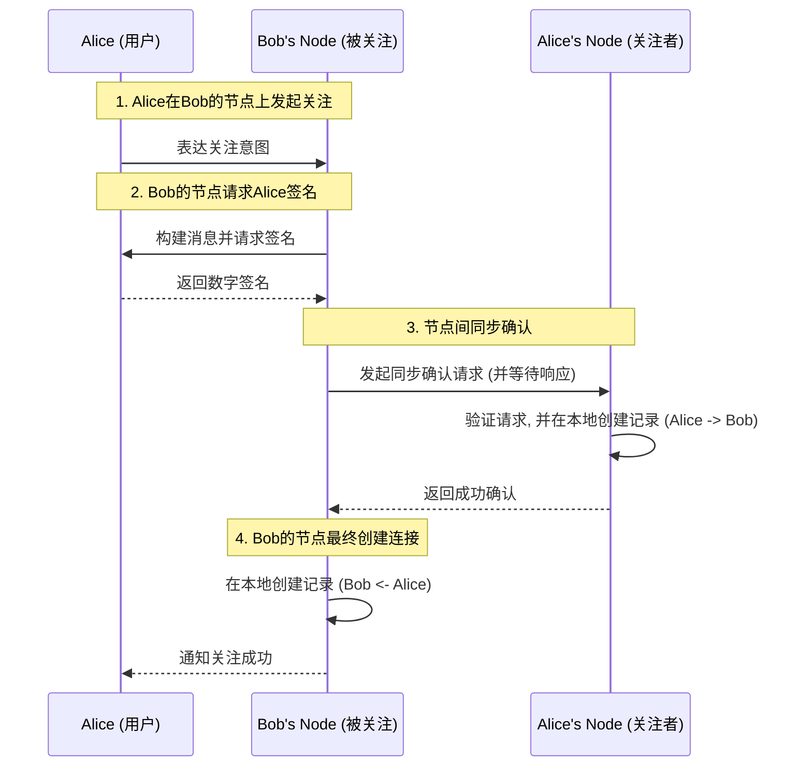
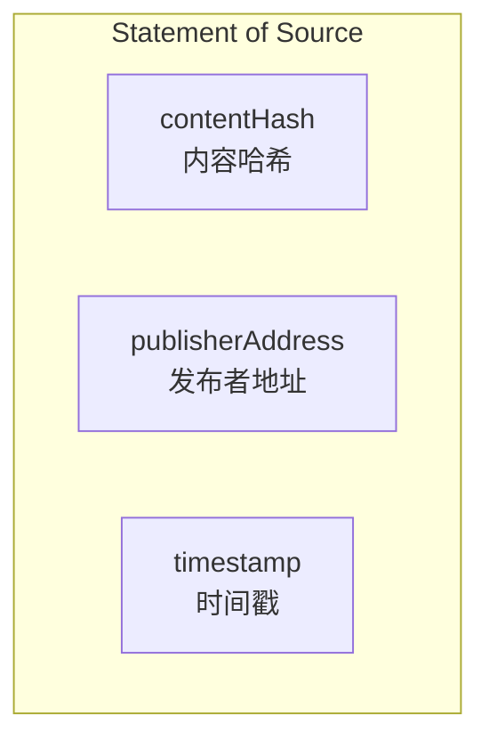
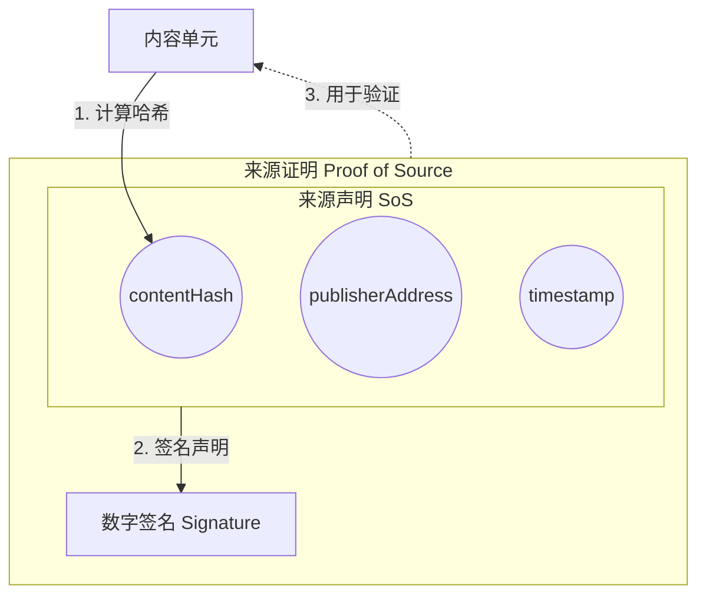
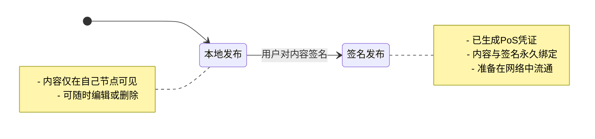
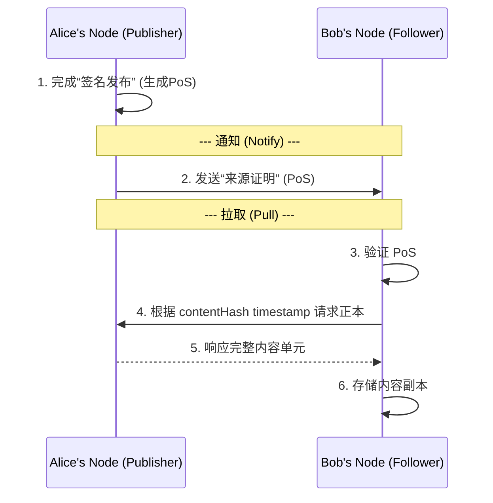
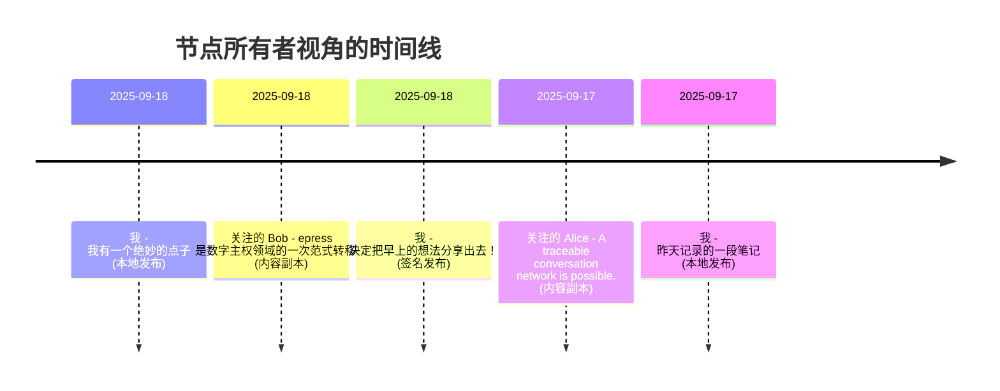
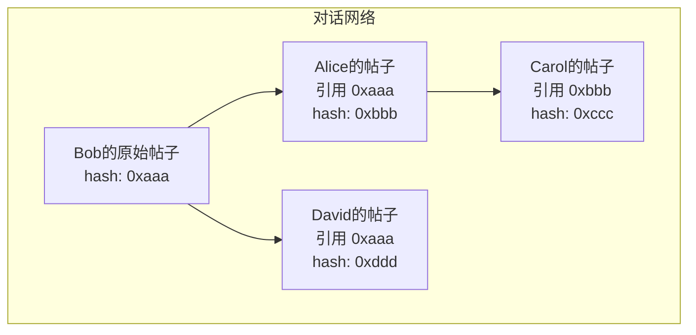
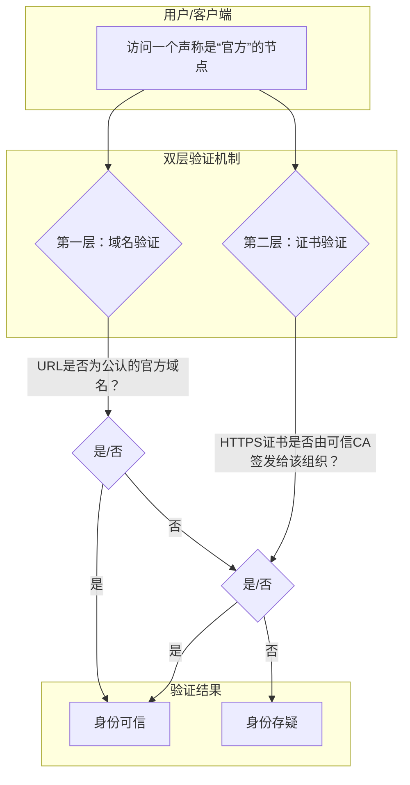
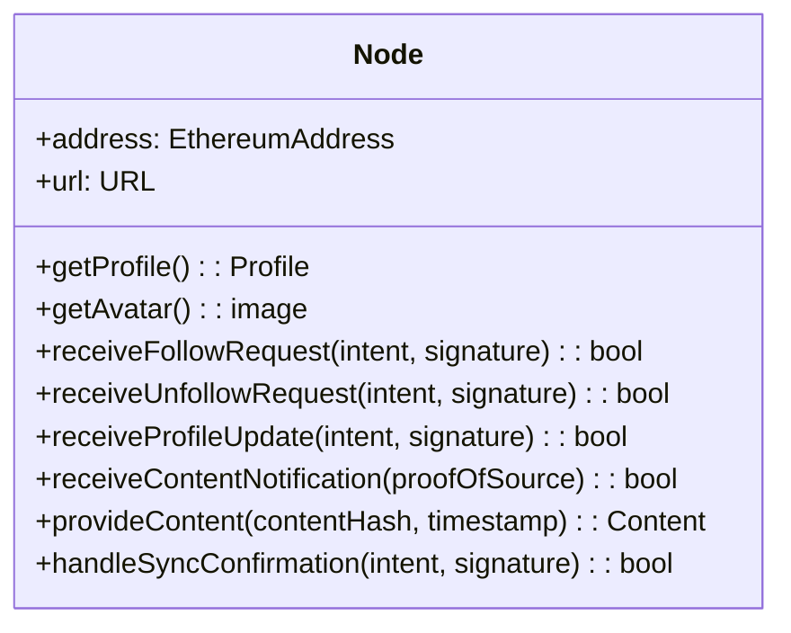

# epress: 一个去中心化的内容与社交网络

## 摘要 

当前主流的中心化网络将用户的数字身份、内容和社交关系置于第三方平台的控制之下，带来了系统性的主权缺失与平台风险。本文提出了一种名为 epress 的去中心化内容与社交网络架构，旨在从根本上解决这一问题。

epress 回归自托管（Self-Hosting）的第一原则，将网络定义为由无数对等节点的集合。每个节点都是一个与用户密码学身份（以太坊账户）绑定的独立网站，是用户在数字世界的主权领土。节点间通过一套开放的点对点协议（EWP）建立连接和传播内容。所有公开发布的内容都以一个名为“来源证明”（Proof of Source）的可验证数据单元形式存在，它以密码学方式确保了任何信息的来源、完整性和时间戳。

通过这套机制，epress 构建了一个无需信任任何中心化机构的网络，其数据所有权和控制权内生于独立的个体。其最终目标是催生一个更开放、更具韧性、且无需许可的创新生态，将互联网从“信息互联网”向“价值互联网”演进。

## 1. 引言 

### 1.1 中心化网络的信任依赖

当前主流的互联网架构，将数十亿用户连接到一个由中心化服务器管理的全球网络中。这种模式极大地促进了信息的创造和流通，但其根基建立在一个脆弱的假设之上：用户必须无条件地信任一个第三方服务提供商来托管其数字身份、内容和社交关系。

在这种架构下，用户更像是平台的“数字租客”，而非其数字家园的“主人”。他们的数据——无论是公开发表的文章，还是私密的社交图谱——都存储在不属于自己的服务器上。这种所有权的分离，导致了一种系统性的风险：平台的规则制定者拥有单方面切断服务的绝对权力。用户的数字生命，包括其毕生积累的创作和声誉，可能因为一次不透明的政策变更、一次算法的错误判断，甚至仅仅是商业模式的转变，而在瞬间被剥夺。

我们认为，一个要求用户让渡其数据主权的系统，在根本上是不可靠的。

### 1.2 现有解决方案的局限性

为了应对中心化带来的困境，社区已经进行了诸多有价值的探索。然而，现有的主流去中心化模型，在不同程度上做出了妥协，未能从根本上解决问题，其核心症结在于**无法彻底摆脱对第三方基础设施的依赖**。

#### 1.2.1 联邦制模型的局限

以 Mastodon 和 Bluesky 为代表的联邦制网络，将信任从一个单一的“大中心”分散到数千个由独立管理员运营的“小中心”（实例）。这无疑是巨大的进步，但其本质是“信任的转移”，而非“信任的消除”。用户的数据和身份依然托管于其所在实例的服务器上，受该实例管理员的管辖。

更深层次的问题在于，这些“小中心”的运营者需要持续投入服务器、存储和带宽资源。从经济角度看，他们最终将不可避免地需要走向商业化，无论是通过广告还是其他变现手段。这使得联邦制网络在发展后期可能面临与中心化平台类似的商业化压力，用户的数字主权在最后一公里依然缺失。

#### 1.2.2 中继模型的局限

以 Nostr 为代表的中继模型，通过极简的协议和一组“中继器”（Relay）来传递消息。这种设计的简洁性值得称赞，但它将网络的活性和内容的可用性，寄托于这些功能类似“公告板”的中继器的稳定运行。

用户的消息能否被他人看到和获取，完全依赖于这些自愿运行的中继器。这不仅为信息流通的稳定性带来了新的不确定性，也同样没有解决对第三方基础设施的依赖问题。网络的健康，取决于一群动机和能力都无法保证的匿名运营者的“善意”。

#### 1.2.3 链上/混合模型的局限

一些去中心化社交协议主张将更多关键状态锚定在区块链上，以获得不可篡改与强身份保证。但以 Farcaster 为代表的成熟实现表明，现实系统通常采用一种**混合架构**：将账户、身份与关键元数据等少量信息锚定在链上（例如在 Optimism/以太坊上的合约），而把大多数高频、体量大的社交交互（发帖、关注、点赞、帖文正文等）放在名为 Hubs / Snapchain（Farcaster的离链P2P服务器网络）的离链P2P服务器网络中，以获得可用性与吞吐的扩展性。

这种折中带来了两组并行的局限性。一方面，任何需要上链的操作仍受限于区块链的吞吐与费用波动：在网络拥堵时，链上交易的成本与延迟会显著上升，进而影响用户体验和规模化采用的可预测性；另一方面，离链的 Hub 网络虽然去中心化且允许任何人运行节点，但它依然依赖节点运营者投入带宽、存储与运维资源——这会引入实际的经济成本、可用性风险以及潜在的集中化压力（例如少数高性能节点承担大部分请求）。因此，Farcaster 并没有“既解决链上限制又完全摆脱第三方依赖”的魔术解法；它只是把问题在链与离链间做了不同的权衡。

**综上所述，现有模型虽各有千秋，却都未摆脱对第三方基础设施的根本性依赖。** 只要服务的可用性需要靠渡让权力来换取，中心化网络与生俱来的风险便无法根除。这迫使我们重新审视问题的本源，寻找一条更具韧性的道路。

### 1.3 自托管：回归互联网的本源

我们今天所熟知的 Web 2.0 模式，由少数科技巨头提供“一站式”服务，它用极致的便利性，换取了用户的控制权，将用户从网络的主人变成了平台的租客。我们认为，要从根本上将数字主权归还给个体，最有效的路径并非创造一个全新的范式，而是选择**回归**一条被历史证明过的、更具韧性的道路：**自托管 (Self-Hosting)**。

做出这个选择，并非标新立异，而是源于对互联网架构本源及其背后精神的追溯。互联网的诞生，伴随着一种强烈的乌托邦精神，它体现在：

*   **信息自由与共享**：万维网的初衷是让知识无障碍地自由流通。
*   **去中心化与平等**：网络被设想为一个没有中央权威、人人皆可平等参与的空间，如早期的 Usenet 和 BBS。
*   **技术乐观主义**：人们相信技术是促进民主和全球连接的解放性力量。
*   **社区与协作**：强调集体创造和社区精神，维基百科便是这种协作愿景的巅峰之作。

这种精神直接催生了互联网的早期技术架构：一个由无数独立的、通过开放协议（如HTTP、SMTP）互联而成的对等网络。这个架构在设计之初，就蕴含着深刻的去中心化思想，它允许任何组织或个人，运行自己的服务器并平等地接入全球网络。

然而，这种理想的个体化普及在当时面临两个难以逾越的障碍：
1.  **高昂的成本**：个人用户难以负担独立的服务器和带宽费用。
2.  **复杂的技术**：部署和维护一个网络服务器，对普通人来说是遥不可及的。

正是这两个障碍，使得便利的中心化服务最终主导了互联网，并逐渐让我们遗忘了那个更开放的、属于个体的可能性。但今天，这些障碍正在被技术进步所消解：

1.  **关于成本**：云计算的普及已大幅降低了服务器的基准成本。同时，通过对应用程序的精心设计，使其能兼容个人电脑或家庭服务器等低成本环境，完全有可能为用户提供近乎零成本的运行方案。
2.  **关于技术**：技术门槛的消除，正循着两条路径展开。第一条路径，是通过巧妙的软件工程和AI辅助的自动化运维，将复杂的部署与维护过程，封装成普通用户可以轻松使用的产品。第二条路径，则是一种社会化分工的演进，它更符合现实逻辑：正如我们使用家用电器，无需理解其内部构造，当它损坏时，可以求助于专业的维修人员。同样，未来的自托管生态，也必将催生出为个人节点提供有偿维护服务的专业“数字管道工”，用户无需成为技术专家，也能享用自托管带来的全部益处。

因此，自托管的可行性，在今天已不再是一个“有或无”的问题，而是一个如何通过巧妙的软件设计和健康的生态建设，将其大规模普及的问题。因此，通过普及自托管构建一个全球规模的去中心化社交网络具有理论上的可行性，而是否可以实现取决于我们是否能解决其中的挑战。

### 1.4 核心挑战

基于自托管原则构建一个功能完备、体验流畅的全球社交网络，并非易事。它要求我们必须从第一性原理出发，解决四个环环相扣的核心技术挑战：

1.  **去中心化身份**：如何在一个没有中心化注册机构的世界里，让用户拥有并证明自己的身份？
2.  **去中心化连接**：在没有中央服务器的情况下，用户之间如何发现彼此，并建立稳固的社交连接？
3.  **去中心化内容流通**：如何设计一种机制，让一个用户创造的内容，可以高效、可靠地传递给所有关注他的用户？
4.  **时间线的生成**：每个用户如何将自己发布的内容和所有关注对象发布的内容，聚合成本地一条连贯的时间线？

## 2. 身份：以太坊账户

在任何社交网络中，一个稳定、唯一的身份都是所有交互的基础。在一个没有中心化注册机构的系统中，我们必须找到一种无需许可、且由用户完全掌控的身份解决方案。为此，epress 选择直接采用当前最成熟、最广泛的去中心化身份体系：**以太坊账户**。

### 2.1 去中心化身份

在 epress 网络中，用户的身份即其以太坊地址。我们选择以太坊账户作为身份层，是基于其固有的、无法被取代的优势：

*   **主权所有**：每个以太坊账户都由一个独一无二的私钥所控制。只有私钥的持有者，才能代表该账户行事。这从根本上保证了身份的所有权只属于用户自己。
*   **无需许可**：任何人都可以自由地创建任意数量的以太坊账户，无需任何中心化机构的批准或许可。这确保了身份的获取是公平且无门槛的。
*   **全局唯一**：一个以太坊地址是全球唯一的标识符，确保了网络中不会出现身份混淆。
*   **安全可靠**：以太坊生态经过了长达数年的发展和实战检验，其公私钥密码学体系的安全性已得到广泛共识。采用它，意味着我们无需重新发明一个脆弱的身份系统。

因此，一个形如 `0x...` 的以太坊地址，便成为用户在 epress 世界中唯一的、可随身携带的“数字护照”。

### 2.2 身份认证

确立了身份之后，还需要一个机制让用户能够安全地证明自己对该身份的所有权。epress 采用密码学中的数字签名技术，结合以太坊社区广泛采纳的两类标准来完成这一目标。

- 节点所有者与本节点的认证：当用户需要管理自己的节点时（例如发布新内容、修改设置等），系统会按照 [EIP-4361](https://eips.ethereum.org/EIPS/eip-4361)：Sign-In with Ethereum (SIWE) 标准，向用户展示一段人类可读的文本消息。用户使用以太坊钱包（如 MetaMask）对消息签名，节点即可验证签名，从而确认该用户确实是该地址的持有者。这一过程取代了传统的“用户名-密码”组合，确保只有密钥所有者才能管理节点。

- 节点所有者与其他节点的认证：节点所有者需要与其他节点进行交互时（例如关注、评论等），则使用 [EIP-712](https://eips.ethereum.org/EIPS/eip-712) 定义的结构化数据签名标准，为了防止重放攻击，该结构化数据中会包含一个时间戳，接收方节点仅在特定时间窗口内视其为有效。这样，接收方节点可以验证发起方签名的有效性，确保操作确实由声明的以太坊地址所有者授权，避免了身份伪造与冒充。

## 3. 节点：网络的基本单元

epress 网络由无数对等的“节点”（Node）组成，节点是构成整个网络的最基础的独立单元。

从功能上看，一个节点就是一个由用户自托管的、功能完备的个人网站。用户可以像使用 WordPress 一样，在自己的节点上发布文章、管理页面、并与访问者进行互动。它是用户在网络中进行内容创作、聚合信息和自我表达的“数字家园”。

从架构上看，一个节点是一个独立的 epress 软件实例，它在密码学上与一个唯一的用户身份（以太坊地址）相绑定。这意味着，该节点以及其中存储的所有数据——包括用户的全部作品、社交关系和个人设置——都完全归属于该身份的所有者。因此，节点是用户在数字世界里不容侵犯的“主权领土”，是数据主权得以实现的最终保障。

要理解节点在实践中的运作方式，我们首先需要建立一个全新的世界观：在 epress 网络中，每一个“节点”不仅是一个个人网站，更是一个独立的、活跃的“**社交个体**”，它代表了其所有者在网络中的完整存在。因此，当一个节点“关注”另一个节点时，并非是网站之间的技术链接，而是节点所有者之间，通过其节点为代理，建立社会性连接并**订阅对方内容更新**的意愿表达。

## 4. 连接：构建社交图谱

### 4.1 关系建模

在 epress 网络中，节点间的关注关系被建模为一条从关注者（Follower）指向被关注者（Followee）的有向边（Directed Edge）：

$Follow(Alice, Bob): ID_A \rightarrow ID_B$

其中 $ID_A$ 与 $ID_B$ 分别为 Alice 和 Bob 节点的唯一身份标识，即它们的以太坊地址。

### 4.2 连接流程：一次同步确认的握手

为了在分布式环境中确保连接的双方都明确同意并一致地记录关系，epress 采用了一种事务性的“同步确认握手”流程。这个过程在验证身份之外，还通过一个事务性的同步步骤，旨在确保连接在双方节点上被同时创建或都不创建，从而维护数据的一致性。

整个流程始于被关注者（Bob）的节点网站，由关注者（Alice）发起，其交互过程如下图所示：



这个流程可以分解为三个关键阶段：

1.  **用户授权与签名**：首先，关注者（Alice）在被关注者（Bob）的节点网站上表达关注意图。Bob的节点会构建一个符合 EIP-712 标准的结构化消息，并请求Alice的钱包进行签名。这一步在密码学上确立了“Alice希望关注Bob”这一事实，且该意图不可伪造。

2.  **同步通告与远端创建**：签名后的意向被提交给Bob的节点。但Bob的节点此时并不会立即信任这份“意向”并写入数据库。取而代之的是，它会向意向中声明的Alice的节点发起一个**同步的确认请求**，并**阻塞等待**响应。Alice的节点在收到这个请求后，会执行完整的验证流程，确认无误后，**首先在自己的数据库中创建连接记录**（“我关注了Bob”），然后向Bob的节点返回成功响应。

3.  **本地创建与最终一致**：**只有在收到Alice的节点明确的成功回执后**，Bob的节点才会在自己的数据库中创建对应的连接记录（“Alice关注了我”）。这个机制确保了只有在关注方（Alice）已经成功记录关系后，被关注方（Bob）才会记录。如果第2步中的任何环节失败（例如Alice的节点不在线、拒绝或验证失败），Bob的节点将不会创建任何记录，从而保证了双方数据的一致性。

通过这个严谨的、类似两阶段提交的事务流程，epress 确保了社交图谱中的每一条连接都是双方共识的结果，避免了因单方面记录而可能导致的数据不一致状态。

### 4.3 分布式稀疏关系表

通过这个流程，网络中没有一个中心化的服务器存储着完整的社交全景。取而代之的是，**每个节点仅需存储与自己相关的边**（即“我关注了谁”和“谁关注了我”），共同**形成一张分布式的稀疏关系表**。

这张表的全局视图——即 `epress` 的完整社交图谱——正是**全网所有节点存储的边的逻辑总和**。它并非由任何中心所设计或掌控，而是一种自下而上、自然涌现的结构，其所有权被彻底地分散到了每一个参与者手中。

## 5. 内容：可验证的信息单元

在节点间建立连接之后，下一个核心挑战是确保信息在这些连接上的流通是安全且可信的。在一个没有中心化仲裁者的对等网络中，任何接收到的原始数据本质上都是不可信的，因为它缺乏固有的机制来回答以下关于其来源和完整性的基本问题：

*   **来源真实性**：如何确认一份数据确实由其声称的发布者所创建，而非来自一个冒充的第三方？
*   **内容完整性**：如何确保一份数据从发布到接收的整个过程中，未被任何中间环节篡改？

为了解决这两个核心问题，我们不能直接在网络上传输原始数据。我们必须设计一种数据结构，它能将原始数据与其来源和完整性的密码学证明封装在一起。本章将阐述这种“可验证信息单元”的构造，其核心是我们称之为“来源证明”（Proof of Source）的机制。

### 5.1 内容单元与内容哈希

我们将任意形式的原始数据，如文本或二进制文件，定义为一个**内容单元**。

每个内容单元都通过一种密码学哈希函数（如 **SHA-256**）进行计算，生成一个定长的、独一无二的摘要。这个过程可表示为：

$ContentHash = \text{SHA-256}(ContentUnit)$

我们称等式左侧的结果为**内容哈希**（Content Hash）。

这种哈希计算的特性是单向且确定性的：任何输入数据只能生成唯一一个哈希值，而任何人都无法从哈希值反推出原始数据。更重要的是，对原始数据的任何微小改动（哪怕只修改一个比特），都会导致生成一个完全不同、不可预测的哈希值。

因此，内容哈希在协议中扮演了两个关键角色：

1.  作为内容在全网流通的**全局唯一ID**。
2.  作为一种高灵敏度的“校验和”，用于在后续步骤中验证内容自发布以来，是否保持了**绝对的完整性**。

### 5.2 来源声明 (Statement of Source, SoS)

我们定义一个名为“**来源声明**”（Statement of Source, SoS）的结构化数据，用以陈述发布的元信息。它由以下三个核心字段组成，清晰地回答了“谁，在什么时间，发布了什么内容”：



### 5.3 来源证明 (Proof of Source, PoS)

为了让这份“来源声明”变得可信，发布者需要使用其身份所对应的私钥，对整个 SoS 进行数字签名，从而生成最终的“**来源证明**”（Proof of Source, PoS）。

PoS 的生成过程，以及它与内容单元的关系如下图所示：



“来源证明”（PoS）是 epress 网络中的核心创造，它是一个将**来源声明（SoS）**与**数字签名**相结合的数据单元。它是一个可独立验证的密码学凭证，用于向网络中的任何第三方证明内容的**来源真实性**与**内容完整性**。

至此，一个“可验证信息单元”便已构造完成。它由作为凭证的“来源证明”（PoS）和作为载体的“内容单元”（原始数据）共同组成，并准备在网络中流通。

## 6. 流通：内容在节点间流动

这个由“来源证明（PoS）”和“内容单元”组成的信息包裹，是如何在由节点构成的分布式网络中，从创作者高效、可靠地送达到其所有关注者手中的？

这个过程并非一次性的“推送”，而是通过一个我们称之为“通知-拉取（Notify-Pull）”的异步模型来完成。在阐述这个模型之前，我们首先需要区分内容发布的两种关键状态。

### 6.1 发布的两种状态：本地与签名

内容创作的起点，发生在用户自己的节点之上。在 epress 中，“发布”这一行为，存在两种明确的状态：

1.  **本地发布**
    用户在自己的节点上撰写并保存内容。在此状态下，内容仅作为其个人网站的一部分存在，可被自由编辑或删除，且仅对直接访问该节点网址的访客可见。

2.  **签名发布**
    当用户决定将一份本地内容分享给网络时，他们可以执行一个独立的“签名发布”操作。此操作会触发节点为该内容生成一个我们在上一章定义的“来源证明”（PoS）。

“签名发布”是内容进入去中心化网络流通的唯一触发器。



### 6.2 通知-拉取模型

签名发布完成后，若将完整的PoS和内容（尤其是音频、视频等大文件）直接推送给成百上千的关注者，会给发布者节点带来巨大的带宽压力且难以保证送达。为了高效、可靠地完成大规模内容分发，我们引入了“通知-拉取”模型。

该模型将内容的分发过程，拆分为两个独立的阶段：

1.  **通知 (Notify)**
    当一个节点发布新内容时，它并不会立即广播完整的内容数据。取而代之的是，它会向其“关注者列表”中的所有节点，发送一个极其轻量的“来源证明”（PoS）。这个 PoS 本身不包含任何内容原文，它仅作为一个“新内容已发布”的通知凭证。这个通知过程是廉价、快速且幂等的。

2.  **拉取 (Pull)**
    关注者节点在接收到这个 PoS 通知后，会首先进行验证，确保该通知的来源（发布者）在自己的关注列表中，然后再对 PoS 进行密码学验证。验证通过后，节点将立即使用 PoS 中包含的 `contentHash`和`timestamp`，通过一个标准化的接口，向发布者节点发起请求，完整**拉取**内容单元`正本`，并存储为本地`副本`。如果拉取过程有任何失败，关注者可以有各种重试策略来确保内容传递的最终成功。

这种“通知-拉取”模型，将内容分发的负担从发布者转移到了订阅者，其优势在于：
*   **发布者效率**：极大地节省了发布者节点的带宽资源，使其能够服务于远超其带宽承载能力的关注者数量。
*   **网络弹性**：关注者节点无需保持永久在线。即使错过了最初的通知，它也可以在重新上线后，通过其他机制主动向其关注的节点查询错过的更新。




当然，这种模型依然有局限性，在中心化系统中，一个意见领袖动则拥有上万，上十万百万甚至上亿的关注者都不稀奇，在这种规模下，这种模型可能会在每次发布给节点带来一次瞬时系统流量洪峰，内容不仅无法正常传递还可能造成节点宕机下线。

### 6.3 影响力的经济成本
在去中心化社交网络中，节点的运行成本并非均衡分布，而是与其拥有的影响力正相关。普通用户的发布与传播规模有限，即便在低配的环境中运行（如廉价云主机、家庭服务器或个人电脑），也足以满足需求，几乎接近零成本。但对于意见领袖这类拥有大量关注者的节点，每一次内容分发都可能引发成千上万次的拉取请求，瞬时带宽与计算压力会呈指数级上升，这使得他们必须为更高的影响力付出更多成本，无论是增加基础设施投入还是通过软件深度定制实现性能提升。

影响力不是免费的，这是自托管有别于托管于中心化系统的根本性区别。在中心化系统中，平台方通过广告或内容授权等方式，间接承担了头部用户的巨大流量成本。而在自托管模型中，这个成本则直接、透明地回归到影响力的拥有者自身。换言之，节点的运行成本随着其影响力的增长而自然上升，这是系统可持续运行的重要约束条件，也是基于自托管模型去中心化网络的内在经济规律与公平性基础。

## 7. 时间线：内容的聚合与排序
前述章节定义了节点间如何建立连接以及内容如何在连接上传播。然而，一个功能完备的社交网络，还需要将这些离散的信息，为用户聚合成一个连贯、有序的视图。这个视图，就是我们所熟知的时间线。在epress中，时间线的生成是一个完全在本地节点上完成的、确定性的过程。

一个节点所呈现的时间线，由两类来源的内容汇集而成：

- 该节点所有者自己创建的全部内容，无论其处于“本地发布”状态还是“签名发布”状态。

- 该节点从其关注的所有其他节点处，通过“通知-拉取”模型获取并存储在本地的内容副本。

至关重要的是，所有需要进入流通或进行排序的内容，都必然拥有一个可供排序的时间戳。对于已“签名发布”的内容（无论是自己的还是他人的），这个时间戳来自于其不可分割的密码学凭证——“来源证明”（Proof of Source, PoS）。对于仅“本地发布”的内容，其时间戳则由节点自身在创建或更新时记录。

这个timestamp字段，为内容的排序提供了唯一的、确定性的依据。节点的软件只需执行一个简单的本地操作：扫描其数据库中存储的所有内容单元，读取每一个内容单元所对应的时间戳，然后将它们按时间倒序排列。



值得注意的是，这里描述的是节点所有者登录后看到的“**聚合时间线**”。对于公开访客而言，他们看到的是另一份不同的时间线，该时间线只包含这个节点本身产出的内容（包括已签名和未签名的本地内容），而不会包含该节点所关注的其他人的内容。

## 8. 引用：转发与分享

对他人内容的再传播（例如“转发”或“分享”）是社交网络不可或缺的基础功能。但在一个没有中心化数据库的去中心化网络中，我们应该如何满足这一需求呢？

epress的答案是回归文本交互的本质：直接利用被广泛使用的Markdown块引用（Blockquote）语法。当一个用户希望分享另一个帖子时，他们只需在自己的新帖子中，通过块引用格式，包含指向原文的归属和链接即可。

这种方式不仅满足了分享的需求，更因为其结构化的特性，为构建一个可追溯的对话网络带来了可能性。

### 8.1 引用的结构
在epress中，任何一篇新帖子都可以通过标准的Markdown语法，引用一篇已存在的、经过签名的帖子。一个设计良好的引用，必须包含三个核心部分，以确保其归属清晰、内容明确、且来源可验。

**示例：** Alice发布了一篇新帖子，其中引用了Bob的帖子。

```markdown
我非常同意Bob的观点，并且我还想补充几点...

> [Bob's Node](https://bob-node.example.com):
> 
> epress是数字主权领域的一次范式转移。
> 
> ---
> *[原始链接](https://bob-node.example.com/publications/0xabc...def)*
```

这个引用结构清晰地展示了三个要素：
1.  **来源归属**：第一行通过一个链接，明确指出了被引用的内容来自“Bob's Node”。
2.  **引用内容**：中间是被引用的原文（或其摘要）。
3.  **可验证链接**：最后一行是一个指向原始帖子URI的永久链接，该链接中必须包含原始帖子的`contentHash`。这个哈希是验证引用真实性的关键。

### 8.2 可追溯的对话网络
这种基于`contentHash`的引用机制，在epress网络中，构建起一个完全去中心化的、可被任意第三方程序化验证和追溯的**对话网络**。

由于每一次引用都包含了对上一个内容哈希的“指针”，我们可以从任何一个帖子出发，沿着引用链，回溯整个对话的完整路径。这使得一些在当前互联网上难以实现的想法成为了可能。



如上图所示，任何人都可以通过分析链上的引用关系，清晰地描绘出一场对话是如何从Bob的原始帖子开始，衍生出Alice和David两个不同分支，并进一步演进的。

## 9. 信任与验证：锚定真实世界身份
在一个无需许可、任何人都可以自由加入的网络中，普通用户如何确信一个声称代表某公众人物、企业或组织的节点，确实是其官方的真实存在，而非恶意的仿冒者？

中心化社交平台通过引入自有的、由平台方裁决的验证（比如Twiter的“蓝标”）体系来应对此问题。但在一个没有中央仲裁机构的 epress 网络中，我们必须寻求一种去中心化的解决方案。我们的答案是：回归并利用互联网发展至今已极其成熟的公共信任基础设施。epress 并未发明一套全新的验证体系，而是将两种既有的、被广泛信赖的Web标准，作为锚定节点真实世界身份的天然机制。

### 9.1 第一层验证：域名
在数字世界中，一个官方域名是组织或企业最重要、最公开的身份资产之一。政府、企业及各类组织投入了大量资源来建立和维护其官方网站的权威性，公众也早已习惯于通过域名来识别一个实体的官方线上存在。

epress 天然地继承了这份信任。由于每个节点本质上都是一个自托管的网站，其验证的第一层便来自于它所使用的域名。当一个 epress 节点运行在一个公认的官方域名之下时，它就自然继承了该域名所承载的全部信誉。

例如：

- 一个节点部署在 social.un.org 域名下，它可以被合理地认为是联合国的官方节点。

- 一个节点URL为 press.my-company.com，它就代表了 my-company.com 这个企业的官方发声渠道。

因此，域名成为了在去中心化网络中，验证公众实体身份的、最直观凭证。

### 9.2 第二层验证：HTTPS 数字证书
对于没有专属域名的个人，或者需要进一步增强信任度的组织，epress 利用了互联网的另一大信任基石：公钥基础设施（PKI）及其产物 HTTPS 证书。

一个标准的 HTTPS 证书由全球信任的证书颁发机构（Certificate Authority, CA）在验证了网站所有者的真实身份后签发。任何人都可以检查一个节点所使用的 HTTPS 证书的详细信息，从而获得由权威 CA 背书的身份证明。

特别是组织验证型（OV）或扩展验证型（EV）证书，它们包含了经过严格审查的组织名称和地理位置信息。当用户访问一个节点时，其客户端不仅能确认通信是加密的，还能通过解析证书，以密码学的方式验证该节点确实由证书上所声明的那个实体所运营。



## 10. epress world protocol

前面数章定义的身份、节点、连接、内容和流通机制，共同构成了一套开放的应用层互操作协议，我们在这里定义所有epress节点连接而成的去中心化网络为`epress world`，因此我们将该协议命名为 **epress world protocol(EWP）**。EWP 是所有节点实现互联互通、共同组成一个去中心化社交网络的全部技术规范。

一个标准的epress节点，可以被抽象为一个实现了EWP核心接口的类：



EWP的核心，是具体定义了上述接口背后的三种关键交互行为：

### 10.1 身份识别
任何节点都必须能向外界提供其不可伪造的身份信息。这对应了类图中的`getProfile()`和`getAvatar()`方法。

```
// 定义 Profile 数据结构
structure Profile {
  address: EthereumAddress  // 节点的以太坊地址
  title: String             // 节点标题
  url: URL                  // 节点可访问的URL
}

// 定义一个获取节点身份的标准化函数
function getProfile(node: Node) returns Profile {
  // EWP 规范了一种标准化的方式,
  // 以通过网络向目标节点请求其公开的 Profile。
  return node.publicProfile
}
```

### 10.2 连接管理
节点间的关注关系，必须通过一个严格的"同步确认握手"流程来建立，以确保双方数据的最终一致性。这对应了`receiveFollowRequest()`和相关的同步确认方法。其核心逻辑如下：

```
// Alice (关注者) 希望关注 Bob (被关注者)
function follow(alice: Node, bob: Node) {
  // 1. Alice 在 Bob 的节点网站上表达关注意图
  // 2. Bob 的节点构建符合 EIP-712 标准的结构化消息，并请求 Alice 签名
  followIntent = createFollowIntent(alice.address, bob.address, timestamp)
  signature = alice.wallet.signEIP712(followIntent)
  
  // 3. Bob 的节点接收到签名后，在其 receiveFollowRequest 方法中执行同步确认流程
// function BobNode::receiveFollowRequest(intent, signature) {
    // 3a. 验证签名的有效性
    assert( verifyEIP712Signature(intent, signature, alice.address) )
    
    // 3b. 向 Alice 的节点发起同步确认请求，并等待响应
    confirmationResponse = syncConfirmRequest(alice.node, intent, signature)
    
    // 4. 只有在收到 Alice 节点的成功确认后，才在本地创建关注记录
    if (confirmationResponse.success) {
      database.addFollower(alice.address)  // "Alice 关注了我"
      return success
    } else {
      return failure  // 如果同步确认失败，不创建任何记录
    }
//  }
}

// Alice 节点处理来自 Bob 节点的同步确认请求
function handleSyncConfirmation(intent, signature) {
  // 1. 验证请求的完整性和签名
  assert( verifyEIP712Signature(intent, signature, intent.followerAddress) )
  assert( intent.followerAddress == this.address )
  
  // 2. 首先在自己的数据库中创建关注记录
  database.addFollowing(intent.followeeAddress)  // "我关注了 Bob"
  
  // 3. 返回成功确认给 Bob 的节点
  return { success: true }
}
```
*（注：此流程的完整交互时序，已在4.2节的时序图中详细展示。）*

### 10.3 内容流通
内容流通遵循“通知-拉取”模型，对应了`receiveContentNotification()`和`provideContent()`方法。其核心逻辑可分解为“发布”和“接收”两个函数：

```
// Alice (发布者) 发布新内容
function publish(alice: Node, content: Content) {
  // 1. 为内容生成包含签名的“来源证明” (PoS)
  proofOfSource = createPoS(alice, content)
  
  // 2. (通知阶段) 向自己的所有关注者广播这个 PoS
  for (follower in alice.getFollowers()) {
    notify(follower, proofOfSource) // 此操作会触发对方节点的 receiveContentNotification
  }
}

// Bob (关注者) 收到来自 Alice 的通知
function onReceiveNotification(proofOfSource) {
  // 1. 验证来源：确保发布者在自己的关注列表中
  assert( isFollowing(proofOfSource.publisherAddress) )

  // 2. 验证凭证：对 PoS 进行密码学验证 (签名、时间戳等)
  assert( verifyPoS(proofOfSource) )
  
  // 3. (拉取阶段) 从 PoS 中获取所需参数,
  //    然后向发布者节点请求完整的内容原文。
  publisher = getNodeFromAddress(proofOfSource.publisherAddress)
  content = pullContent(publisher, proofOfSource.contentHash, proofOfSource.timestamp)
  
  // 4. 验证内容哈希一致后，在本地存储内容副本
  database.saveContent(content)
}
```
*（注：此流程的交互细节，已在6.2节的时序图中展示。）*

### 10.4 其他关键交互

EWP 协议同样也为其他关键交互（如取消关注、更新资料）定义了标准流程，它们遵循与前述流程相似的密码学原则：

*   **取消关注 (`receiveUnfollowRequest`)**: 取消关注是一个需要双方确认的事务性操作。关注者（Alice）向被关注者（Bob）的节点发送一个经由自己签名的“取消关注意图”。Bob 的节点在验证签名有效后，删除“Alice关注了我”的记录，并向 Alice 的节点返回成功回执。**只有在收到成功回执后**，Alice 的节点才会在本地删除“我关注了Bob”的记录，从而确保连接在两端都被干净地解除。

*   **资料更新 (`receiveProfileUpdate`)**: 当节点所有者更新其公开资料（如节点标题、头像）时，节点会生成一份包含**完整新资料**和时间戳的、经签名的声明。由于资料数据量小且可预测，节点会**直接将这份包含完整信息的签名声明推送**给所有关注者。关注者节点在收到通知并验证后，即可直接使用其中的信息更新本地存储的资料副本。

因此，这些关键交互也同样建立在可验证、去中心化的基础之上，从而维持了协议的整体一致性和安全性。


## 11. 设计哲学：系统边界
节点是私人领地，而网络是公共空间，PoS是连接私人领地和公共空间的桥梁，私域公域泾渭分明。这样的设计哲学从根本上决定了系统的边界。

### 11.1 关于隐私 
epress 在其核心架构上，被设计为一个完全公开、可追溯的全球内容网络，而非一个私密的通信工具。

在这种设计哲学下，隐私并非通过对已发布内容的加密来实现，而是体现在发布前的**自主选择权**。用户的节点是其完全主权的数字领土，如同一个私人的笔记本。用户可以在自己的节点上自由地创建、编辑和删除任何本地内容。这些内容在被签名发布前，仅对直接访问其节点的访客可见，它们不属于公共网络的一部分。

隐私的边界，在于用户决定将哪些内容、在什么时间、以自己的身份进行签名并公之于众的那个瞬间。执行“签名发布”这一动作，在功能上等同于将一份私人手稿提交给公共档案馆，其意图即是进入公共领域，成为一份可被永久查阅和引用的公开记录。

这一设计哲学也意味着，EWP 协议本身**不会**为已进入公共领域的内容提供额外的隐私层（如加密或访问控制）。协议的关注点在于保障这份公共记录的真实性。

### 11.2 内容责任
在epress网络中，一旦用户通过签名发布内容，其附带来源证明（PoS）的内容单元将被关注者节点同步复制，并在每个节点本地保存带有PoS的副本。这意味着，签名发布后的内容理论上无法完全销毁。那么，这是否意味着用户需对其签署的内容承担永久责任？

要回答这个问题，我们需回归PoS的本质定义。PoS作为来源证明，其核心目的是在节点间信息传递中确认身份真实性。用户的签名行为仅限于验证内容的来源、完整性和时间戳，从而确保接收者能追溯“谁在何时发布了什么”。其责任边界严格限定于来源真实性：用户无法否认自己在特定时间发布过特定内容，但这并不延伸到内容的实质义务或法律后果。

与现实中的合同责任形成鲜明对比。合同通常涉及多方主体，约定权利与义务，并通过签名确认各方共识。而在PoS的签署过程中，不存在第二方或第三方，因此无须定义义务主体或权力关系。PoS本质上是单方面的、用于网络内信息流通的身份凭证。从设计上，它不包含对内容本身的责任，除非内容中明确声明了相关义务。

一个典型场景是：用户通过PoS签名向公共空间发布一份声明，但随着时间推移，其观点可能发生变化，甚至完全否定先前立场。此时，用户只需签发新的PoS，发布更新内容、修正声明或明确否认即可。这种机制体现了epress的隐私与主权哲学：用户在发布前拥有绝对自主权，而公开内容则通过后续迭代实现动态修正，而非强制永久责任。
### 11.3 关于审查

在去中心化领域，将“抗审查”作为核心叙事是一种普遍的做法。然而，epress 的出发点并非构建一个用于对抗审查的工具，而是回归一个更基础的原则：**数字世界中的个人主权**。我们相信，如同人们在物理世界拥有家园，人们在数字世界也理应拥有一个可以完全自我掌控的、贯穿一生的可靠栖息之地。

基于这一核心理念，epress 协议在设计上秉持严格的 **“技术中立”** 原则。在内容裁决的议题上，协议的角色并非评判内容，而是提供一个中立的、可验证的基础层，以确认信息的来源与完整性。

这样的架构设计，将关于内容取舍的权力和责任，**内在地赋予了每一位节点所有者**。

一个 epress 节点本质上是一个自托管的网站，因此，它天然地需要遵从其服务器所在地的法律与文化管辖。审查的存在与否、其具体尺度和执行方式，成为了节点所有者自己的选择和责任。

如果节点所有者对其当前所处的环境不满，epress 的架构设计使其拥有完整的“迁徙自由”。用户的身份、内容和社交关系可以被无损地打包，并轻松地在任何新的“数字领土”上重新安家。

因此，epress 并不试图为“审查”这个复杂问题提供一个单一的、全局性的答案。它提供的是一个更具韧性的框架——一个权力与责任天然属于个体，并允许多样化局部方案在网络中涌现和共存的框架。

### 11.4 关于数字遗产

当前主流的中心化互联网服务，将用户的数字生命——包括其毕生的创作、社交关系和身份印记——锁定在不属于他们的服务器上。这在用户离世后，催生了一个棘手的法律与伦理困境：数字遗产的归属与处理。平台的政策复杂且不透明，法律框架缺失，家属往往难以获取或管理这些对他们具有重要情感或经济价值的数据。

epress 的自托管架构从根本上消除了这个问题，因为它将数字资产的法律地位，回归到了物理世界早已成熟的“私有财产”范畴。

从一个节点被创建的那一刻起，它以及其中包含的全部数据（内容、社交图谱、身份凭证），在法律性质上便等同于用户的任何其他私人资产，如一栋房产或一个银行账户。因此，这些数字资产的继承，无需依赖任何平台的许可或复杂的申诉流程，它可以被清晰地写入遗嘱、纳入信托，并通过转移节点的访问凭证（例如服务器的登录权限或托管服务的账户）来完成交付。

这确保了数字主权不仅贯穿用户的一生，更能超越生命的终点，成为一份真正可以被传承的、永恒的个人遗产。

## 12. 不止于社交网络：迈向价值互联网
当数以百万计的节点通过 EWP 协议互联，一个前所未有的、统一的、可验证的、可被机器读取的 **“全球思想图谱”（Global Thought Graph）** 便会浮现。

这个图谱由三个核心元素构成：
*   **节点（Nodes）**：代表着网络中一个个拥有主权的独立实体。
*   **来源证明（PoS）**：代表着由这些实体所发布的、一条条可验证的“事实”或“观点”。
*   **引用（Quotes）**：代表着这些“事实”之间有向的、可追溯的连接。

当社交图谱和内容记录从一个个封闭的“公司内网”，变成一个可通过开放协议访问的公共数据时，依赖平台方授权的创新障碍便被移除，一个无需许可的创新环境得以形成。

### 12.1 价值发现：去中心化的“佩奇排名”

epress 网络在本质上是一个由“身份”为点、“引用”为边的全球有向图。这一特性使得创造去中心化的“思想搜索引擎”成为可能。

一个观点（由其 `contentHash` 代表）的价值，将不再由平台的算法所主导，而是可以通过类似 Google PageRank（一种基于链接分析的网页排名算法）的算法，根据引用它的其他节点的信誉和数量来被客观地计算。这将构建一个真正的价值发现网络，使得深刻、原创的思想，能够从信息的噪音中自动脱颖而出。

### 12.2 客观的信誉衡量：可携带的贡献证明

由于所有贡献（“签名发布”）都与一个永恒的身份绑定且不可篡改，一个参与者的完整贡献历史是公开、可审计的。这使得构建专门的、客观的贡献证明（Proof of Contribution）系统成为可能。

例如，一个服务于科学界的系统，可以不依赖于任何期刊，而是通过一个科学家的研究成果在 epress 网络中被同行引用、讨论和验证的程度，来直接衡量其学术影响力。一个服务于艺术界的系统，则可以清晰地展示一个原创作品是如何启发了一系列的衍生创作。

在这种模式下，个体的信誉将第一次变得可计算、可累积、可携带。它将成为个人最有价值的、可以跨越任何应用和平台的无形资产。

### 12.3 可信数据层：应对信息污染挑战
随着生成式人工智能（AI）的普及，一个迫切的挑战是如何应对海量、低质量的AI生成内容可能对数字信息生态造成的系统性污染。这种污染会导致网络信息信噪比的急剧下降，并可能形成“AI学习垃圾数据→生成更多垃圾→进一步污染网络”的恶性循环。epress 架构并非为解决此问题而设计，但其核心机制在客观上为构建一个更具韧性的信息生态提供了可能。

- 来源可验证性作为过滤机制：epress 网络的每个公开发布内容都必须以一个名为“来源证明”（Proof of Source, PoS）的可验证数据单元形式存在，它以密码学方式确保了任何信息的来源、完整性和时间戳。这使得网络上的数据不再是来源不明的混合体，而是由无数可信、可验证的“事实点”构成的全球图谱。内容消费者（包括未来的 AI 模型）可以优先选择那些拥有完整 PoS 且来自高信誉实体的训练数据，从源头缓解了信息污染问题。

- 影响力与成本的内在约束：epress 强调自托管原则，并采用“通知-拉取”的内容分发模型。这导致节点的运行成本与其影响力（关注者数量）直接挂钩：一个拥有大规模关注者的节点，其内容分发将带来显著的带宽与计算成本。这为 AI 垃圾生产者设置了天然的经济障碍，不像在中心化平台可以轻松利用匿名或批量账户免费刷量，在 epress 中，大规模发布和传播垃圾需要真实资源投入，发布不再是“免费午餐”。这一内在的经济机制从根本上抑制了无节制的“内容洪水”。此外，节点是“主权领土”，用户对自己的内容有完全控制，但公开签名发布后是永久记录，这鼓励更谨慎的创作，而不是AI随意生成。

- 引用和信誉系统促进价值发现：epress 构建了一个基于引用的“全球思想图谱”，其价值发现机制依赖于类似 PageRank 的去中心化算法，而非中心化平台的算法操控。高质量、原创的内容因其更可能获得真实的引用而脱颖而出，而缺乏深度或原创性的AI生成内容则因难以获得真实引用而更容易被边缘化。这种机制鼓励了有价值的内容创作，从而间接帮助了信息生态的“净化”。

epress 架构并未强制进行内容质量审查，但通过将发布权力与责任完全归还给个体，并用密码学锚定信息的真实性，它提供了一个开放、可验证的数据层，任何开发者都可以在此之上无需许可地构建和部署治理工具或 AI 检测服务，以应对特定的信息挑战。

### 12.4 开放的创新层：可组合的应用生态

当数据成为公共资源，任何人，无论是大型公司还是独立开发者，都可以无需许可地在其上构建应用。

*   **可组合的用户生成内容（UGC）服务**：实际上，所有我们今天所熟知的中心化用户生成内容（UGC）服务，都可以在 epress 的范式下被重新构建。这套新范式着手解决用户在当前互联网环境下普遍面临的一个困境：**自己的数字足迹被割裂地锁定在互不相通的平台孤岛中**。

    在 epress 的架构中，用户的节点是其所有数据的**权威发布源头**。任何一篇影评、一次餐厅打卡，其“正本”都源自用户自己的节点。开发者可以通过 EWP 协议与网络中的公开数据进行交互，从而构建例如影评或美食评价等垂直应用。这些“应用”更像是一个个“数据浏览器”或“策展者”，而非数据的“所有者”。

    这种模式不仅能通过可追溯的来源信息，天然地抑制了刷分、控评等行为，提供更可信的服务。更有甚者，它从根本上重塑了数据的经济关系：当用户成为其数据的唯一源头时，他们便拥有了向使用其数据的商业应用收取报酬的可能性，而不是像今天这样无偿地为平台贡献价值。

    更进一步，当内容本身成为一种可验证的、归属于清晰身份的数字资产时，一个真正的**内容价值发现与交易市场**便有了建立的基础。

    在 epress 网络中，创作者可以自由、无成本地发布任意数量的内容。对于其中他们认为具有高度价值的作品——例如一篇深度研究报告、一幅数字艺术品或一段原创音乐——创作者无需依赖任何新的第三方。他们可以直接利用以太坊等公共区块链及其开放的智能合约标准（如 [ERC-721](https://eips.ethereum.org/EIPS/eip-721)），将该作品通过‘来源证明’（PoS）中的关键信息注册为一个代表其所有权的 NFT。

    由于遵循了开放的链上标准，这个 NFT 随后可以在任何兼容的公开市场上被自由交易。这就在 epress 的开放信息层之上，催生了一个无需许可、全球可达的**内容权利交易层**。原创内容不再仅仅是“信息”，而是可以被定价、授权、转让和组合的“价值资产”。这为创作者经济（Creator Economy）提供了一套远比当前平台更公平、更透明的基础设施。

*   **以用户为中心的算法**：在当前平台，用户只能被动接受由平台提供的单一、不透明的推荐算法。而在 epress 的开放生态中，算法可以作为一种独立的服务存在。用户将可以自由选择、组合甚至自己编写算法，来决定自己想看到一个怎样的世界——一个“只看我最信任的人”的算法，一个“最大化新奇与意外”的算法，或一个“只关注某个垂直专业领域”的算法。算法的权力，将从平台回归到用户手中。

### 12.5 全新的分析维度：思想的“数字考古学”

epress 网络天然是一个由无数可验证的、带有时间戳的通信事件组成的高保真数据库。这为社会科学家和数据研究者提供了前所未有的、研究人类思想与文化如何真实传播的无偏见“培养皿”。

他们可以精确地绘制出任何一个观点、理论或文化模因（Meme）的诞生、变异、传播和消亡的全过程，而无需再依赖于被中心化平台过滤和加工后的“二手数据”。这将使我们第一次能够以考古学般的精度，来研究思想本身的历史。

---

## 13. 结论
我们在此提出了一种去中心化内容与社交网络的架构。

该架构以用户独立的密码学身份为基石，将每一个自托管的节点定义为不可分割的主权领土。节点间通过一套开放的点对点协议进行通信，所有公开发布的内容都以可验证的、附带时间戳的“来源证明”形式在网络中流通。

其最终结果是，一个数字身份、社交图谱和内容记录的控制权内生于个体的系统得以实现，它无需信任任何中心化的第三方。

